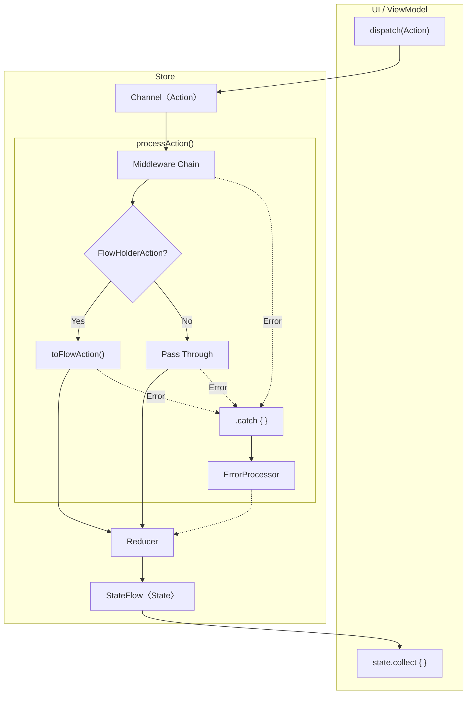

# Flowdux

A lightweight Redux-style state management library for Kotlin Multiplatform with Middleware support.

[](https://jitpack.io/#chibimoons/flowdux)

## Features

- Redux-style state management with Reducer pattern
- Middleware support for side effects
- Error handling with ErrorProcessor
- Built on Kotlin Coroutines and Flow
- Kotlin Multiplatform support (JVM, iOS)

## Architecture



| Component | Role |
|-----------|------|
| **Middleware** | Side effects (API calls, logging), action transformation |
| **FlowHolderAction** | Convert existing Flow to Action stream |
| **ErrorProcessor** | Catch errors and convert to Actions |
| **Reducer** | Pure function: (State, Action) → NewState |

## Installation

Add JitPack repository to your `settings.gradle.kts`:

```kotlin
dependencyResolutionManagement {
    repositories {
        maven { url = uri("https://jitpack.io") }
    }
}
```

Add the dependency to your `build.gradle.kts`:

```kotlin
dependencies {
    implementation("com.github.chibimoons:flowdux:1.2.1.1")
}
```

## Usage

### Define State and Actions

```kotlin
data class CounterState(val count: Int = 0) : State

sealed class CounterAction : Action {
    object Increment : CounterAction()
    object Decrement : CounterAction()
    data class Add(val value: Int) : CounterAction()
}
```

### Create a Reducer

```kotlin
val counterReducer = buildReducer<CounterState, CounterAction> {
    on<CounterAction.Increment> { state, _ ->
        state.copy(count = state.count + 1)
    }
    on<CounterAction.Decrement> { state, _ ->
        state.copy(count = state.count - 1)
    }
    on<CounterAction.Add> { state, action ->
        state.copy(count = state.count + action.value)
    }
}
```

### Create a Middleware (Optional)

```kotlin
class LoggingMiddleware : Middleware<CounterState, CounterAction> {
    override val processors = buildProcessors {
        on<CounterAction.Increment> { state, action ->
            println("Incrementing from ${state.count}")
            emit(action)
        }
    }
}
```

### Create an ErrorProcessor

```kotlin
class CounterErrorProcessor : ErrorProcessor<CounterAction> {
    override fun process(throwable: Throwable): Flow<CounterAction> = flow {
        println("Error: ${throwable.message}")
    }
}
```

### Create and Use the Store

```kotlin
val store = createStore(
    initialState = CounterState(),
    reducer = counterReducer,
    middlewares = listOf(LoggingMiddleware()),
    errorProcessor = CounterErrorProcessor(),
    scope = viewModelScope
)

// Observe state
store.state.collect { state ->
    println("Current count: ${state.count}")
}

// Dispatch actions
store.dispatch(CounterAction.Increment)
store.dispatch(CounterAction.Add(10))
```

### FlowHolderAction (Wrap Existing Flow as Actions)

Use `FlowHolderAction` to wrap existing Flows (Repository, Socket) and convert them to Actions.
No side effects in the Action—just holds and transforms the Flow:

```kotlin
// FlowHolderAction wraps an existing Flow and converts to Flow<Action>
data class ObserveUser(
    private val userFlow: Flow<User>
) : UserAction, FlowHolderAction {
    override fun toFlowAction(): Flow<Action> =
        userFlow.map { user -> SetUser(user) }
}

// Usage: pass the Flow from Repository/Socket
val repositoryFlow = userRepository.getUser(123)  // Flow creation (cold)
store.dispatch(ObserveUser(repositoryFlow))       // Store collects it
// State updates: cached user -> fresh user from API
```

## Execution Strategies

FlowDux provides execution strategies to control how concurrent actions are processed in middleware.

### takeLatest(key)

Cancels previous processing when a new action with the same key arrives. Only the latest action's result is emitted.

```kotlin
class SearchMiddleware : Middleware<AppState, AppAction> {
    override val processors = buildProcessors {
        on<AppAction.Search>(takeLatest("search")) { state, action ->
            val results = searchApi.search(action.query)
            emit(AppAction.SearchResults(results))
        }
    }
}
```

Use cases: Search, API refresh, pagination with pull-to-refresh

### takeLeading(key)

Ignores new actions while one with the same key is still processing. Only the first action in a series executes.

```kotlin
class SubmitMiddleware : Middleware<AppState, AppAction> {
    override val processors = buildProcessors {
        on<AppAction.Submit>(takeLeading("submit")) { state, action ->
            // Prevents duplicate submissions
            val result = api.submit(action.data)
            emit(AppAction.SubmitSuccess(result))
        }
    }
}
```

Use cases: Form submission, payment processing, preventing double-clicks

### debounce(duration)

Delays execution. If another action arrives before the delay completes, the previous action is canceled and the timer restarts.

```kotlin
class AutosaveMiddleware : Middleware<AppState, AppAction> {
    override val processors = buildProcessors {
        on<AppAction.TextChanged>(debounce(500.milliseconds)) { state, action ->
            // Only saves after user stops typing for 500ms
            api.save(action.text)
            emit(AppAction.SaveComplete)
        }
    }
}
```

Use cases: Search autocomplete, autosave, input validation

### throttle(duration)

Limits execution rate. Executes the first action immediately, then ignores subsequent actions until the time window passes.

```kotlin
class AnalyticsMiddleware : Middleware<AppState, AppAction> {
    override val processors = buildProcessors {
        on<AppAction.Scroll>(throttle(1000.milliseconds)) { state, action ->
            // Logs scroll position at most once per second
            analytics.logScroll(action.position)
            emit(action)
        }
    }
}
```

Use cases: Analytics events, scroll handling, rate limiting

### Key-based Grouping

Actions with the same key share cancellation/throttling behavior. Use different keys for independent behavior:

```kotlin
// User fetches and product fetches are independent
on<FetchUser>(takeLatest("user")) { state, action ->
    val user = userApi.fetch(action.userId)
    emit(UserLoaded(user))
}

on<FetchProduct>(takeLatest("product")) { state, action ->
    val product = productApi.fetch(action.productId)
    emit(ProductLoaded(product))
}
```

## Sample Apps

### Run JVM Console Sample

```bash
./gradlew :sample-jvm:run
```

Output:
```
=== Flowdux Sample: Counter ===

State: count = 0
> Dispatching Increment
State: count = 1
...
> Dispatching ObserveCount - FlowHolderAction
  (Repository Flow emits: cache -> api)
State: count = 10 [cache]
State: count = 42 [api]
...
```

### Build Android Sample

```bash
./gradlew :sample-android:assembleDebug
```

APK location: `sample-android/build/outputs/apk/debug/sample-android-debug.apk`

### Build KMM Sample (Android)

```bash
./gradlew :sample-shared:androidApp:assembleDebug
```

APK location: `sample-shared/androidApp/build/outputs/apk/debug/androidApp-debug.apk`

### Build KMM Sample (iOS)

**Prerequisites:** Xcode 15+ with command line tools

```bash
# Build shared framework
./gradlew :sample-shared:shared:linkDebugFrameworkIosSimulatorArm64

# Build iOS app
xcodebuild -project sample-shared/iosApp/iosApp.xcodeproj \
  -target iosApp -sdk iphonesimulator -arch arm64 build
```

App location: `sample-shared/iosApp/build/Debug-iphonesimulator/iosApp.app`

### KMM Sample Structure

```
sample-shared/
├── shared/           # Shared Kotlin code (commonMain)
│   └── CounterStore  # Shared business logic
├── androidApp/       # Android UI (Compose)
└── iosApp/           # iOS UI (SwiftUI) - see iosApp/README.md
```

## License

```
Copyright 2024 Flowdux Contributors

Licensed under the Apache License, Version 2.0 (the "License");
you may not use this file except in compliance with the License.
You may obtain a copy of the License at

    http://www.apache.org/licenses/LICENSE-2.0

Unless required by applicable law or agreed to in writing, software
distributed under the License is distributed on an "AS IS" BASIS,
WITHOUT WARRANTIES OR CONDITIONS OF ANY KIND, either express or implied.
See the License for the specific language governing permissions and
limitations under the License.
```
