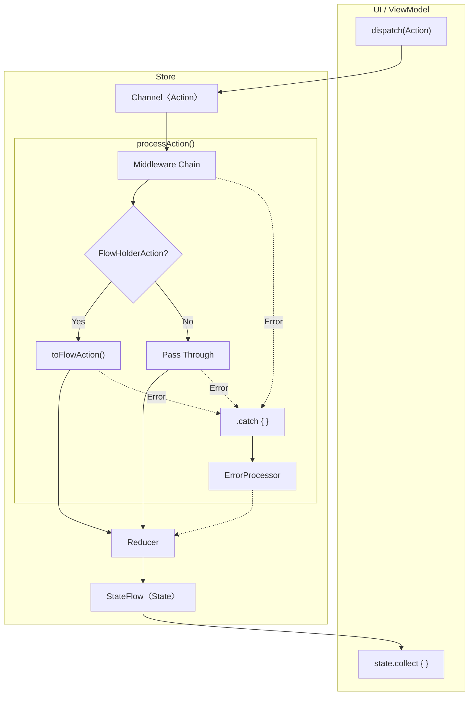

# Flowdux

A lightweight Redux-style state management library for Kotlin Multiplatform with Middleware support.

[](https://jitpack.io/#chibimoons/flowdux)

## Features

- Redux-style state management with Reducer pattern
- Middleware support for side effects
- Execution strategies (takeLatest, takeLeading, debounce, throttle)
- Strategy groups for cross-action coordination
- Error handling with ErrorProcessor
- Time travel debugging (undo/redo, state history)
- Built on Kotlin Coroutines and Flow
- Kotlin Multiplatform support (JVM, iOS)

## Architecture



| Component | Role |
|-----------|------|
| **Middleware** | Side effects (API calls, logging), action transformation |
| **ExecutionStrategy** | Control concurrent action processing (takeLatest, debounce, etc.) |
| **FlowHolderAction** | Convert existing Flow to Action stream |
| **ErrorProcessor** | Catch errors and convert to Actions |
| **Reducer** | Pure function: (State, Action) → NewState |

### Action Flow

Actions can enter the pipeline in two ways:

**1. dispatch() - External Entry Point**

Called from UI or ViewModel to send actions into the Store:

```
dispatch(action) → Channel → Middleware Chain → Reducer → StateFlow
```

```kotlin
// From ViewModel or UI
store.dispatch(SearchAction("query"))
```

**2. emit() - Middleware Internal Emission**

Called within middleware processors to emit resulting actions:

```
emit(action) → (Remaining Middlewares) → Reducer → StateFlow
```

```kotlin
on<SearchAction> { state, action ->
    val results = api.search(action.query)
    emit(SearchResults(results))  // Goes to Reducer
}
```

**Key Differences:**

| | dispatch() | emit() |
|---|---|---|
| Called from | UI, ViewModel (external) | Middleware processor (internal) |
| Entry point | Channel (full pipeline) | Current position in Flow |
| Middleware | All middlewares process | Only remaining middlewares |

**Middleware Patterns:**

```kotlin
// Transform: Convert action to different action
on<FetchUser> { state, action ->
    val user = api.getUser(action.id)
    emit(UserLoaded(user))
}

// Pass through: Let action continue to Reducer
on<LogAction> { state, action ->
    logger.log(action)
    emit(action)
}

// Block: Don't emit to prevent Reducer processing
on<InvalidAction> { state, action ->
    // No emit - action stops here
}

// Multiple emissions
on<BatchAction> { state, action ->
    emit(StartLoading)
    val result = api.fetch()
    emit(DataLoaded(result))
    emit(StopLoading)
}
```

**Note:** Actions without a registered processor in middleware automatically pass through to the Reducer:

```kotlin
// Middleware only handles FetchUser
on<FetchUser> { state, action -> ... }

// Other actions (Increment, Reset, etc.) pass through directly to Reducer
store.dispatch(Increment)  // → Middleware (no processor) → Reducer
```

## Installation

Add JitPack repository to your `settings.gradle.kts`:

```kotlin
dependencyResolutionManagement {
    repositories {
        maven { url = uri("https://jitpack.io") }
    }
}
```

Add the dependency to your `build.gradle.kts`:

```kotlin
dependencies {
    implementation("com.github.chibimoons:flowdux:1.5.0")
}
```

## Usage

### Define State and Actions

```kotlin
data class CounterState(val count: Int = 0) : State

sealed class CounterAction : Action {
    object Increment : CounterAction()
    object Decrement : CounterAction()
    data class Add(val value: Int) : CounterAction()
}
```

### Create a Reducer

```kotlin
val counterReducer = buildReducer<CounterState, CounterAction> {
    on<CounterAction.Increment> { state, _ ->
        state.copy(count = state.count + 1)
    }
    on<CounterAction.Decrement> { state, _ ->
        state.copy(count = state.count - 1)
    }
    on<CounterAction.Add> { state, action ->
        state.copy(count = state.count + action.value)
    }
}
```

### Create a Middleware (Optional)

```kotlin
class LoggingMiddleware : Middleware<CounterState, CounterAction> {
    override val processors = buildProcessors {
        on<CounterAction.Increment> { state, action ->
            println("Incrementing from ${state.count}")
            emit(action)
        }
    }
}
```

### Create an ErrorProcessor

```kotlin
class CounterErrorProcessor : ErrorProcessor<CounterAction> {
    override fun process(throwable: Throwable): Flow<CounterAction> = flow {
        println("Error: ${throwable.message}")
    }
}
```

### Create and Use the Store

```kotlin
val store = createStore(
    initialState = CounterState(),
    reducer = counterReducer,
    middlewares = listOf(LoggingMiddleware()),
    errorProcessor = CounterErrorProcessor(),
    scope = viewModelScope
)

// Observe state
store.state.collect { state ->
    println("Current count: ${state.count}")
}

// Dispatch actions
store.dispatch(CounterAction.Increment)
store.dispatch(CounterAction.Add(10))
```

### Store Lifecycle

Always call `close()` when the store is no longer needed to release resources:

```kotlin
// In ViewModel
override fun onCleared() {
    store.close()
    super.onCleared()
}
```

**isClosed Property:**

Check `isClosed` before dispatching if there's a possibility the store may be closed:

```kotlin
if (!store.isClosed) {
    store.dispatch(action)
}
```

**Note:** Dispatching after `close()` is logged via `StoreLogger.onDispatchAfterClose()` and may indicate a bug in your application.

### Time Travel Debugging

Time travel debugging is available as a separate module:

```kotlin
// build.gradle.kts
implementation("com.github.chibimoons.flowdux:flowdux-timetravel:1.5.0")
```

```kotlin
import io.flowdux.timetravel.createTimeTravelStore

val store = createTimeTravelStore(
    initialState = CounterState(),
    reducer = counterReducer,
    middlewares = listOf(LoggingMiddleware()),
    maxHistorySize = 100        // Optional: limit history size (default: 100)
)

// Use like a regular store
store.dispatch(CounterAction.Increment)
store.dispatch(CounterAction.Add(10))

// Access history
store.history.forEach { snapshot ->
    println("Index: ${snapshot.index}, State: ${snapshot.currentState}, Action: ${snapshot.action}")
}

// Navigate through time
store.undo()           // Go to previous state
store.redo()           // Go to next state
store.jumpTo(0)        // Jump to initial state
store.reset()          // Alias for jumpTo(0)

// Check navigation availability
if (store.canUndo) store.undo()
if (store.canRedo) store.redo()

// Clear history (keeps current state as new initial)
store.clear()
```

**StateSnapshot Properties:**

| Property | Description |
|----------|-------------|
| `index` | Position in history (0 = initial) |
| `action` | Action that caused this state (null for initial) |
| `previousState` | State before the action (null for initial) |
| `currentState` | State after the action |
| `timestamp` | When the state change occurred |

**Restoring History:**

You can restore a previous session's history using a separate overload:

```kotlin
// Save history (e.g., to JSON)
val savedHistory = store.history

// Later, restore from saved history
val restoredStore = createTimeTravelStore(
    initialHistory = savedHistory,  // Restores state and history
    reducer = counterReducer
)
// restoredStore starts at the last state in savedHistory
```

**Branching Behavior:**

When dispatching from a past state (after `undo()` or `jumpTo()`), future history is discarded:

```kotlin
// History: [0] -> [1] -> [2] -> [3]
store.jumpTo(1)           // Now at state [1]
store.dispatch(NewAction) // History becomes: [0] -> [1] -> [new]
                          // States [2] and [3] are discarded
```

### Logging

Use `DebugStoreLogger` for development debugging:

```kotlin
val store = createStore(
    initialState = CounterState(),
    reducer = counterReducer,
    logger = DebugStoreLogger("MyStore")
)
```

> **Warning:** `DebugStoreLogger` prints the entire State and Action objects via `println()`. Do not use in production as it may expose sensitive information (tokens, passwords, personal data). Use `NoOpStoreLogger` (default) or implement a custom `StoreLogger` with proper filtering for production.

### FlowHolderAction (Wrap Existing Flow as Actions)

Use `FlowHolderAction` to wrap existing Flows (Repository, Socket) and convert them to Actions.
No side effects in the Action—just holds and transforms the Flow:

```kotlin
// FlowHolderAction wraps an existing Flow and converts to Flow<Action>
data class ObserveUser(
    private val userFlow: Flow<User>
) : UserAction, FlowHolderAction {
    override fun toFlowAction(): Flow<Action> =
        userFlow.map { user -> SetUser(user) }
}

// Usage: pass the Flow from Repository/Socket
val repositoryFlow = userRepository.getUser(123)  // Flow creation (cold)
store.dispatch(ObserveUser(repositoryFlow))       // Store collects it
// State updates: cached user -> fresh user from API
```

## Execution Strategies

FlowDux provides execution strategies to control how concurrent actions are processed in middleware.

### takeLatest(key)

Cancels previous processing when a new action with the same key arrives. Only the latest action's result is emitted.

```kotlin
class SearchMiddleware : Middleware<AppState, AppAction> {
    override val processors = buildProcessors {
        on<AppAction.Search>(takeLatest("search")) { state, action ->
            val results = searchApi.search(action.query)
            emit(AppAction.SearchResults(results))
        }
    }
}
```

Use cases: Search, API refresh, pagination with pull-to-refresh

### takeLeading(key)

Ignores new actions while one with the same key is still processing. Only the first action in a series executes.

```kotlin
class SubmitMiddleware : Middleware<AppState, AppAction> {
    override val processors = buildProcessors {
        on<AppAction.Submit>(takeLeading("submit")) { state, action ->
            // Prevents duplicate submissions
            val result = api.submit(action.data)
            emit(AppAction.SubmitSuccess(result))
        }
    }
}
```

Use cases: Form submission, payment processing, preventing double-clicks

### debounce(duration)

Delays execution. If another action arrives before the delay completes, the previous action is canceled and the timer restarts.

```kotlin
class AutosaveMiddleware : Middleware<AppState, AppAction> {
    override val processors = buildProcessors {
        on<AppAction.TextChanged>(debounce(500.milliseconds)) { state, action ->
            // Only saves after user stops typing for 500ms
            api.save(action.text)
            emit(AppAction.SaveComplete)
        }
    }
}
```

Use cases: Search autocomplete, autosave, input validation

### throttle(duration)

Limits execution rate. Executes the first action immediately, then ignores subsequent actions until the time window passes.

```kotlin
class AnalyticsMiddleware : Middleware<AppState, AppAction> {
    override val processors = buildProcessors {
        on<AppAction.Scroll>(throttle(1000.milliseconds)) { state, action ->
            // Logs scroll position at most once per second
            analytics.logScroll(action.position)
            emit(action)
        }
    }
}
```

Use cases: Analytics events, scroll handling, rate limiting

### Strategy Groups

Use `group` to share a strategy instance across multiple action types. Actions within the same group will coordinate their execution (e.g., one action can cancel another):

```kotlin
class SearchMiddleware : Middleware<AppState, AppAction> {
    override val processors = buildProcessors {
        // SearchAction and RefreshAction share the same takeLatest instance
        // Dispatching RefreshAction will cancel an in-progress SearchAction
        group(takeLatest("search")) {
            on<SearchAction> { state, action ->
                val results = searchApi.search(action.query)
                emit(SearchResults(results))
            }
            on<RefreshAction> { state, action ->
                val results = searchApi.refresh()
                emit(SearchResults(results))
            }
        }

        // Debounce across multiple input types
        group(debounce(300.milliseconds)) {
            on<TextChanged> { state, action ->
                emit(ValidateInput(action.text))
            }
            on<FilterChanged> { state, action ->
                emit(ApplyFilter(action.filter))
            }
        }
    }
}
```

**Important:** Each action type can only be registered once per middleware. Duplicate registrations will throw `DuplicateProcessorException`.

## Sample Apps

### Run JVM Console Sample

```bash
./gradlew :sample-jvm:run
```

Output:
```
=== Flowdux Sample: Counter ===

State: count = 0
> Dispatching Increment
State: count = 1
...
> Dispatching ObserveCount - FlowHolderAction
  (Repository Flow emits: cache -> api)
State: count = 10 [cache]
State: count = 42 [api]
...

==================================================
=== Execution Strategy Examples ===
==================================================

> takeLatest: Rapid search (only latest completes)
  Dispatching Search('a'), Search('ab'), Search('abc') rapidly...
    [takeLatest] Searching for: a
    [takeLatest] Searching for: ab
    [takeLatest] Searching for: abc
    [takeLatest] Search completed: abc
  Result: Only 'abc' search completed!

> debounce: Wait 200ms after last input
  Dispatching FetchData rapidly...
    [debounce] Fetching data: 3
  Result: Only last FetchData executed after 200ms quiet period!

> takeLeading: Prevent double form submission
  Dispatching SubmitForm 3 times rapidly...
    [takeLeading] Processing form submission...
    [takeLeading] Form submitted!
  Result: Only first submission processed, others ignored!

> Strategy Group: LoadUser and RefreshUser share takeLatest
  Dispatching LoadUser, then RefreshUser (cancels LoadUser)...
    [group] Loading user: 123
    [group] Refreshing user...
    [group] User refreshed!
  Result: LoadUser was canceled, only RefreshUser completed!
```

### Build Android Sample

```bash
./gradlew :sample-android:assembleDebug
```

APK location: `sample-android/build/outputs/apk/debug/sample-android-debug.apk`

### Build KMM Sample (Android)

```bash
./gradlew :sample-shared:androidApp:assembleDebug
```

APK location: `sample-shared/androidApp/build/outputs/apk/debug/androidApp-debug.apk`

### Build KMM Sample (iOS)

**Prerequisites:** Xcode 15+ with command line tools

```bash
# Build shared framework
./gradlew :sample-shared:shared:linkDebugFrameworkIosSimulatorArm64

# Build iOS app
xcodebuild -project sample-shared/iosApp/iosApp.xcodeproj \
  -target iosApp -sdk iphonesimulator -arch arm64 build
```

App location: `sample-shared/iosApp/build/Debug-iphonesimulator/iosApp.app`

### KMM Sample Structure

```
sample-shared/
├── shared/           # Shared Kotlin code (commonMain)
│   └── CounterStore  # Shared business logic
├── androidApp/       # Android UI (Compose)
└── iosApp/           # iOS UI (SwiftUI) - see iosApp/README.md
```

## License

```
Copyright 2024 Flowdux Contributors

Licensed under the Apache License, Version 2.0 (the "License");
you may not use this file except in compliance with the License.
You may obtain a copy of the License at

    http://www.apache.org/licenses/LICENSE-2.0

Unless required by applicable law or agreed to in writing, software
distributed under the License is distributed on an "AS IS" BASIS,
WITHOUT WARRANTIES OR CONDITIONS OF ANY KIND, either express or implied.
See the License for the specific language governing permissions and
limitations under the License.
```
