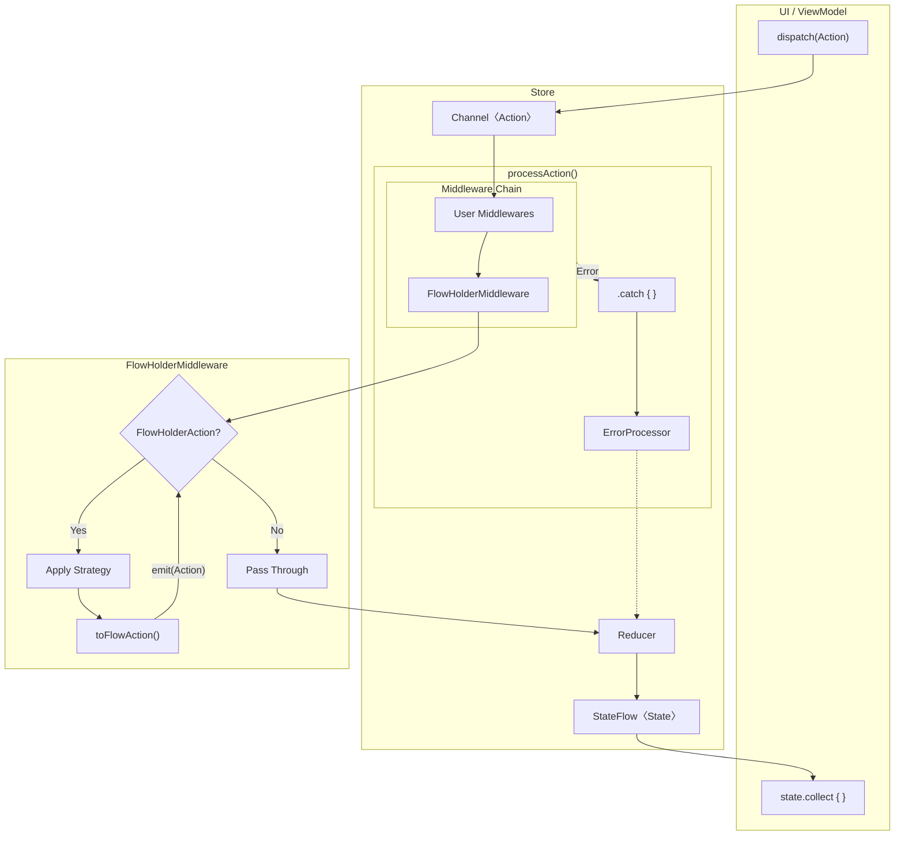

# Flowdux

A lightweight Redux-style state management library for **Kotlin Multiplatform** and **Dart/Flutter** with Middleware support.

[](https://jitpack.io/#chibimoons/flowdux)
[](https://pub.dev/packages/flowdux)
[](https://pub.dev/packages/flowdux_flutter)

## Features

- Redux-style state management with Reducer pattern
- Middleware support for side effects
- Execution strategies (takeLatest, takeLeading, sequential, debounce, throttle, retry)
- Strategy chaining and groups for flexible action coordination
- Error handling with ErrorProcessor
- Time travel debugging (undo/redo, state history) - Kotlin only
- Built on Kotlin Coroutines and Flow / Dart Streams
- Kotlin Multiplatform support (JVM, iOS, JS, WASM)
- Dart/Flutter support with Flutter bindings

## Architecture



| Component | Role |
|-----------|------|
| **Middleware** | Side effects (API calls, logging), action transformation |
| **FlowHolderMiddleware** | Processes FlowHolderAction with ExecutionStrategy (auto-added) |
| **ExecutionStrategy** | Control concurrent action processing (takeLatest, sequential, debounce, retry, etc.) |
| **FlowHolderAction** | Convert existing Flow to Action stream |
| **ErrorProcessor** | Catch errors and convert to Actions |
| **Reducer** | Pure function: (State, Action) → NewState |

## Action Flow

Actions can enter the pipeline in two ways:

**1. dispatch() - External Entry Point**

Called from UI or ViewModel to send actions into the Store:

```
dispatch(action) → Channel → Middleware Chain → Reducer → StateFlow
```

**2. emit() - Middleware Internal Emission**

Called within middleware processors to emit resulting actions:

```
emit(action) → (Remaining Middlewares) → Reducer → StateFlow
```

**Key Differences:**

| | dispatch() | emit() |
|---|---|---|
| Called from | UI, ViewModel (external) | Middleware processor (internal) |
| Entry point | Channel (full pipeline) | Current position in Flow |
| Middleware | All middlewares process | Only remaining middlewares |

## FlowHolderAction

`FlowHolderAction` is an Action that holds and transforms an existing Flow/Stream into a stream of Actions.

**Why use FlowHolderAction?**

- Wrap existing reactive streams (Repository, WebSocket, Database) without side effects in the Action
- The Action itself is pure - it just holds a reference to the stream
- Stream collection happens in FlowHolderMiddleware, not in the Action

```
┌─────────────────────────────────────────────────────────────────┐
│  FlowHolderAction                                               │
│  ┌──────────────┐      ┌──────────────┐      ┌──────────────┐  │
│  │ Repository   │ ───► │ toFlowAction │ ───► │ Action       │  │
│  │ Flow/Stream  │      │ (transform)  │      │ Stream       │  │
│  └──────────────┘      └──────────────┘      └──────────────┘  │
└─────────────────────────────────────────────────────────────────┘
                                │
                                ▼
                    FlowHolderMiddleware collects
                    and emits each Action to Reducer
```

**Use cases:**
- Observing real-time data (user profile, chat messages)
- WebSocket connections
- Database change listeners
- Any existing Flow/Stream that needs to update state

## Execution Strategies

Execution strategies control how concurrent actions of the same type are processed.

### Strategy Categories

| Category | Strategies | Purpose |
|----------|------------|---------|
| **Concurrency** | `takeLatest()`, `takeLeading()`, `sequential()`, `concurrent()` | How to handle concurrent executions |
| **Timing** | `debounce(duration)`, `throttle(duration)` | When to execute |
| **Resilience** | `retry(n)`, `retryWithBackoff(...)` | How to handle failures |

### Concurrency Strategies

```
takeLatest()     - Cancel previous, keep latest (search, refresh)
                   [A1]──X  [A2]──X  [A3]────►

takeLeading()    - Ignore new while processing (form submit, payment)
                   [A1]────────────►  [A2]X  [A3]X

sequential()     - Queue and process in order (message queue)
                   [A1]────►[A2]────►[A3]────►

concurrent()     - Run all in parallel (independent fetches)
                   [A1]────────►
                   [A2]────────►
                   [A3]────────►
```

### Timing Strategies

```
debounce(300ms)  - Wait for quiet period (autocomplete, autosave)
                   [A1]·[A2]·[A3]·······[execute A3]

throttle(1000ms) - Rate limit (scroll, analytics)
                   [A1]────►  [A2]X  [A3]X  [A4]────►
```

### Resilience Strategies

```
retry(3)                    - Retry on failure (network errors)
retryWithBackoff(3, 100ms)  - Retry with exponential delay
```

### Strategy Chaining

Combine strategies from different categories using `then`:

```
debounce(300ms) then takeLatest() then retry(3)
```

**Rules:**
- Strategies from different categories can be chained
- Strategies from the same category cannot be chained (throws exception)

### Strategy Groups

Share a strategy instance across multiple action types. Actions in the same group coordinate their execution:

```
group(takeLatest()) {
    SearchAction    ─┐
    RefreshAction   ─┴─► Same strategy instance
}
// Dispatching RefreshAction cancels in-progress SearchAction
```

---

<details>
<summary><h2>Kotlin</h2></summary>

### Installation

Add JitPack repository to your `settings.gradle.kts`:

```kotlin
dependencyResolutionManagement {
    repositories {
        maven { url = uri("https://jitpack.io") }
    }
}
```

Add the dependency to your `build.gradle.kts`:

```kotlin
dependencies {
    implementation("com.github.chibimoons:flowdux:1.7.0")
}
```

### Define State and Actions

```kotlin
data class CounterState(val count: Int = 0) : State

sealed class CounterAction : Action {
    object Increment : CounterAction()
    object Decrement : CounterAction()
    data class Add(val value: Int) : CounterAction()
}
```

### Create a Reducer

```kotlin
val counterReducer = buildReducer<CounterState, CounterAction> {
    on<CounterAction.Increment> { state, _ ->
        state.copy(count = state.count + 1)
    }
    on<CounterAction.Decrement> { state, _ ->
        state.copy(count = state.count - 1)
    }
    on<CounterAction.Add> { state, action ->
        state.copy(count = state.count + action.value)
    }
}
```

### Create a Middleware (Optional)

```kotlin
class LoggingMiddleware : Middleware<CounterState, CounterAction> {
    override val processors = buildProcessors {
        on<CounterAction.Increment> { state, action ->
            println("Incrementing from ${state.count}")
            emit(action)
        }
    }
}
```

### Create an ErrorProcessor

```kotlin
class CounterErrorProcessor : ErrorProcessor<CounterAction> {
    override fun process(throwable: Throwable): Flow<CounterAction> = flow {
        println("Error: ${throwable.message}")
    }
}
```

### Create and Use the Store

```kotlin
val store = createStore(
    initialState = CounterState(),
    reducer = counterReducer,
    middlewares = listOf(LoggingMiddleware()),
    errorProcessor = CounterErrorProcessor(),
    scope = viewModelScope
)

// Observe state
store.state.collect { state ->
    println("Current count: ${state.count}")
}

// Dispatch actions
store.dispatch(CounterAction.Increment)
store.dispatch(CounterAction.Add(10))
```

### Store Lifecycle

Always call `close()` when the store is no longer needed to release resources:

```kotlin
// In ViewModel
override fun onCleared() {
    store.close()
    super.onCleared()
}
```

### FlowHolderAction

Use `FlowHolderAction` to wrap existing Flows (Repository, Socket) and convert them to Actions:

```kotlin
data class ObserveUser(
    private val userFlow: Flow<User>
) : UserAction, FlowHolderAction {
    override fun toFlowAction(): Flow<Action> =
        userFlow.map { user -> SetUser(user) }
}

// Usage
val repositoryFlow = userRepository.getUser(123)
store.dispatch(ObserveUser(repositoryFlow))
```

### Execution Strategies

| Category | Strategies | Purpose |
|----------|------------|---------|
| **Concurrency** | `takeLatest()`, `takeLeading()`, `sequential()` | How to handle concurrent executions |
| **Timing** | `debounce(duration)`, `throttle(duration)` | When to execute |
| **Resilience** | `retry(n)`, `retryWithBackoff(...)` | How to handle failures |

```kotlin
// takeLatest: Cancel previous when new arrives
on<SearchAction>(takeLatest()) { state, action ->
    val results = searchApi.search(action.query)
    emit(SearchResults(results))
}

// debounce: Wait for quiet period
on<TextChanged>(debounce(500.milliseconds)) { state, action ->
    api.save(action.text)
}

// Strategy chaining
on<Search>(debounce(300.milliseconds) then takeLatest() then retry(3)) { state, action ->
    val results = searchApi.search(action.query)
    emit(SearchResults(results))
}
```

### Strategy Groups

Share a strategy instance across multiple action types:

```kotlin
override val processors = buildProcessors {
    group(takeLatest()) {
        on<SearchAction> { state, action -> ... }
        on<RefreshAction> { state, action -> ... }
    }
}
```

### Logging

```kotlin
val store = createStore(
    initialState = CounterState(),
    reducer = counterReducer,
    logger = DebugStoreLogger("MyStore")
)
```

### Time Travel Debugging

```kotlin
// build.gradle.kts
implementation("com.github.chibimoons.flowdux:flowdux-timetravel:1.7.0")
```

```kotlin
val store = createTimeTravelStore(
    initialState = CounterState(),
    reducer = counterReducer,
    maxHistorySize = 100
)

store.undo()
store.redo()
store.jumpTo(0)
store.history.forEach { snapshot -> ... }
```

### Sample Apps

```bash
# JVM Console
./gradlew :kotlin:sample-jvm:run

# Android
./gradlew :kotlin:sample-android:assembleDebug

# Web (JavaScript)
./gradlew :kotlin:sample-web:jsBrowserDevelopmentRun

# WebAssembly
./gradlew :kotlin:sample-wasm:wasmJsBrowserDevelopmentRun
```

### Platform Support

| Platform | Status | Sample |
|----------|--------|--------|
| JVM | ✅ | `kotlin/sample-jvm` |
| Android | ✅ | `kotlin/sample-android` |
| iOS | ✅ | `kotlin/sample-shared/iosApp` |
| JavaScript | ✅ | `kotlin/sample-web` |
| WebAssembly | ✅ | `kotlin/sample-wasm` |

</details>

---

<details>
<summary><h2>Dart / Flutter</h2></summary>

### Installation

**Dart only:**

```yaml
dependencies:
  flowdux: ^0.2.1
```

**Flutter:**

```yaml
dependencies:
  flowdux: ^0.2.1
  flowdux_flutter: ^0.2.1
```

### Define State and Actions

```dart
// State
class CounterState {
  final int count;
  CounterState(this.count);

  CounterState copyWith({int? count}) => CounterState(count ?? this.count);
}

// Actions
class IncrementAction implements Action {}
class DecrementAction implements Action {}
class AddAction implements Action {
  final int value;
  AddAction(this.value);
}
```

### Create a Reducer

```dart
final counterReducer = ReducerBuilder<CounterState, Action>()
  ..on<IncrementAction>((state, _) => state.copyWith(count: state.count + 1))
  ..on<DecrementAction>((state, _) => state.copyWith(count: state.count - 1))
  ..on<AddAction>((state, action) => state.copyWith(count: state.count + action.value));
```

### Create a Store

```dart
final store = createStore<CounterState, Action>(
  initialState: CounterState(0),
  reducer: counterReducer.build(),
);

// Dispatch actions
store.dispatch(IncrementAction());

// Listen to state changes
store.state.listen((state) => print('Count: ${state.count}'));
```

### Middleware with Execution Strategies

```dart
class SearchMiddleware extends Middleware<AppState, Action> {
  SearchMiddleware() {
    apply(takeLatest()).on<SearchAction>((state, action) async* {
      final results = await api.search(action.query);
      yield SearchResultsAction(results);
    });
  }
}
```

### FlowHolderAction

Use `FlowHolderAction` to wrap existing Streams:

```dart
class ObserveUserAction with FlowHolderAction {
  final Stream<User> userStream;

  ObserveUserAction(this.userStream);

  @override
  Stream<Action> toStreamAction() {
    return userStream.map((user) => SetUserAction(user));
  }

  // Default: TakeLatest strategy
  // Override for concurrent: ExecutionStrategy get strategy => concurrent();
}

// Usage
final repositoryStream = userRepository.getUser(123);
store.dispatch(ObserveUserAction(repositoryStream));
```

### Execution Strategies

| Category | Strategies | Purpose |
|----------|------------|---------|
| **Concurrency** | `takeLatest()`, `takeLeading()`, `sequential()`, `concurrent()` | How to handle concurrent executions |
| **Timing** | `debounce(duration)`, `throttle(duration)` | When to execute |
| **Resilience** | `retry(n)`, `retryWithBackoff(...)` | How to handle failures |

```dart
// Strategy chaining
apply(debounce(Duration(milliseconds: 300)).then(takeLatest()))
  .on<SearchAction>((state, action) async* {
    final results = await api.search(action.query);
    yield SearchResultsAction(results);
  });
```

### Flutter Integration

```dart
import 'package:flutter/material.dart' hide Action;
import 'package:flowdux_flutter/flowdux_flutter.dart';

// Provide store to widget tree
StoreProvider<AppState, Action>(
  store: store,
  child: MyApp(),
)

// Consume state in widgets
StoreConsumer<AppState, Action>(
  builder: (context, store, state) {
    return Text('Count: ${state.count}');
  },
)

// Use selector for specific state
StoreSelector<AppState, Action, int>(
  selector: (state) => state.count,
  builder: (context, store, count) {
    return Text('Count: $count');
  },
)

// Listen to state changes for side effects
StoreListener<AppState, Action>(
  listenWhen: (previous, current) => current.navigateTo != null,
  listener: (context, store, state) {
    Navigator.of(context).pushNamed(state.navigateTo!);
  },
  child: MyWidget(),
)
```

### Run Tests

```bash
cd dart/flowdux && dart test
```

### Run Flutter Example

```bash
cd dart/flowdux_flutter/example && flutter run
```

### Platform Support

| Platform | Status | Package |
|----------|--------|---------|
| Dart | ✅ | [flowdux](https://pub.dev/packages/flowdux) |
| Flutter | ✅ | [flowdux_flutter](https://pub.dev/packages/flowdux_flutter) |

</details>

---

## License

```
Copyright 2024 Flowdux Contributors

Licensed under the Apache License, Version 2.0 (the "License");
you may not use this file except in compliance with the License.
You may obtain a copy of the License at

    http://www.apache.org/licenses/LICENSE-2.0

Unless required by applicable law or agreed to in writing, software
distributed under the License is distributed on an "AS IS" BASIS,
WITHOUT WARRANTIES OR CONDITIONS OF ANY KIND, either express or implied.
See the License for the specific language governing permissions and
limitations under the License.
```
