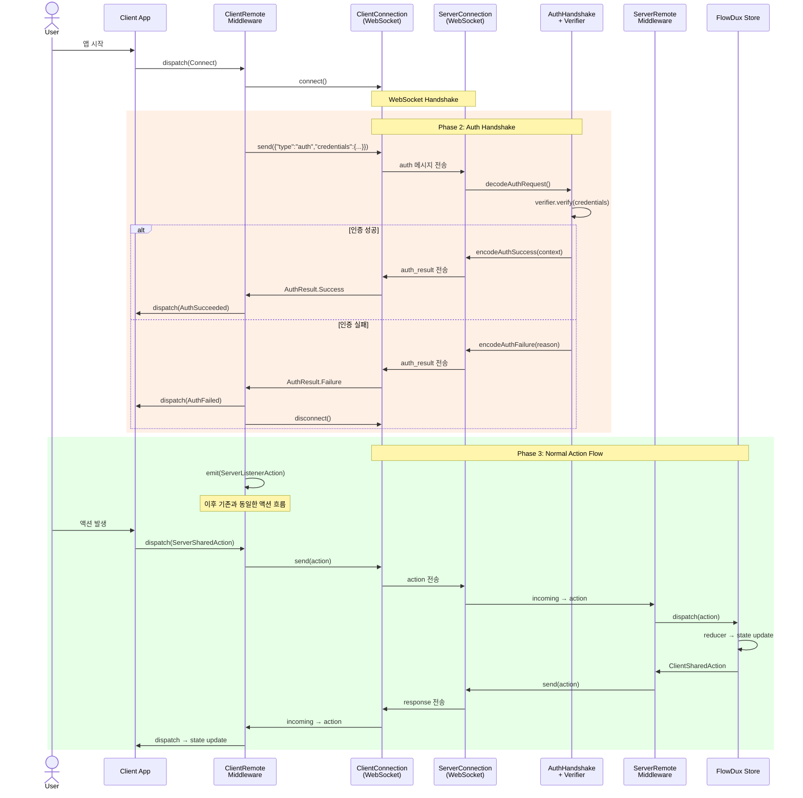

# FlowDux Remote Auth Architecture

> **Design Document** — flowdux-remote에 인증(Authentication) 레이어를 추가하기 위한 아키텍처 설계.

## 1. 현재 구조와 문제

### 1-1. 현재 레이어 구조

```
Transport        ClientConnection / ServerConnection          (raw String)
    ↓
Serialization    TypedClientConnection / TypedServerConnection (typed Action)
    ↓
Middleware       ClientRemoteMiddleware / ServerRemoteMiddleware
    ↓
Store            Reducer → State
```

### 1-2. 현재 한계

- WebSocket 연결이 열리면 **즉시** 액션 흐름이 시작됨
- 누가 연결했는지 알 방법이 없음 (sessionId는 서버가 UUID로 생성)
- 인증되지 않은 클라이언트도 `ServerSharedAction`을 보낼 수 있음
- Multi-client 시나리오에서 사용자 식별이 불가능

```kotlin
// 현재 코드: 인증 없이 바로 연결
webSocket("/chat") {
    val sessionId = UUID.randomUUID().toString()  // 누군지 모름
    val connection = KtorWebSocketServerConnection(this)
        .typedJson<SharedChatAction>() as TypedServerConnection<ChatAction>
    session.handleClient(sessionId, connection)   // 바로 수락
}
```

## 2. 설계 목표

1. **Transport-agnostic**: WebSocket, SSE 등 어떤 전송 계층이든 동작
2. **Optional**: 인증이 필요 없는 앱은 기존 코드 그대로 사용
3. **Pluggable**: JWT, API Key, OAuth, 커스텀 등 어떤 인증 방식이든 끼워 넣기 가능
4. **Layer-clean**: 기존 레이어 구조를 깨지 않고, 그 사이에 자연스럽게 삽입
5. **Identity propagation**: 인증 후 "누구인지"를 이후 레이어에 전달

## 3. 핵심 아이디어: Auth Handshake Layer

Transport와 Serialization 사이에 **인증 핸드셰이크 단계**를 삽입한다.

```
Transport        ClientConnection / ServerConnection          (raw String)
    ↓
★ Auth           AuthHandshake (credential 교환 + 검증)       ← NEW
    ↓
Serialization    TypedClientConnection / TypedServerConnection (typed Action)
    ↓
Middleware       ClientRemoteMiddleware / ServerRemoteMiddleware
    ↓
Store            Reducer → State
```

핵심 원칙:
- 인증은 **첫 번째 메시지 교환**으로 이루어짐 (in-band handshake)
- 인증 실패 시 연결을 끊고, 성공 시에만 TypedConnection으로 넘어감
- 인증 메시지는 일반 액션과 다른 wire format을 사용

## 4. Wire Protocol 확장

### 4-1. 현재 wire format

```
Client → Server:  {"type":"action","payload":{...}}
Server → Client:  {"type":"response","actions":[...]}
```

### 4-2. 인증 메시지 추가

```
Client → Server:  {"type":"auth","credentials":{...}}
Server → Client:  {"type":"auth_result","success":true,"context":{...}}
Server → Client:  {"type":"auth_result","success":false,"error":"..."}
```

### 4-3. 전체 연결 흐름

```
Phase 1: Transport Connect
    Client ──[WebSocket Handshake]──→ Server

Phase 2: Auth Handshake (NEW)
    Client ──{"type":"auth","credentials":{"token":"jwt..."}}──→ Server
                                                                   │
                                                          AuthVerifier.verify()
                                                                   │
    Client ←──{"type":"auth_result","success":true,───────── Server
                "context":{"sessionId":"abc","role":"user"}}

Phase 3: Normal Action Flow (기존과 동일)
    Client ←→ Server (action / response 메시지)
```

## 5. 인터페이스 설계

### 5-1. 공통 타입

```kotlin
// flowdux-remote-auth 모듈

/**
 * 인증 결과. 성공 시 AuthContext를, 실패 시 에러 메시지를 담는다.
 */
sealed class AuthResult<out T> {
    data class Success<T>(val context: T) : AuthResult<T>()
    data class Failure(val reason: String) : AuthResult<Nothing>()
}

/**
 * 인증 성공 후 전달되는 컨텍스트.
 * 서버는 이 정보로 "누구의 연결인지" 알 수 있다.
 */
interface AuthContext {
    val sessionId: String
}
```

### 5-2. 클라이언트 측

```kotlin
/**
 * 클라이언트가 서버에 보낼 인증 정보를 제공한다.
 *
 * 구현 예: TokenAuthProvider("jwt-token"),
 *         CredentialsAuthProvider("user", "pass")
 */
interface ClientAuthProvider {
    /**
     * 인증 정보를 JSON 문자열로 반환.
     * Wire format의 {"type":"auth","credentials":{...}}에서 credentials 부분.
     */
    fun provideCredentials(): String
}

/**
 * 클라이언트 측 인증 핸드셰이크를 수행한다.
 * Transport 연결 후, TypedConnection 생성 전에 호출.
 */
interface ClientAuthHandshake {
    /**
     * raw connection을 통해 인증 핸드셰이크를 수행한다.
     *
     * 1. provider.provideCredentials()로 인증 정보 획득
     * 2. connection.send()로 auth 메시지 전송
     * 3. connection.incoming에서 auth_result 수신
     * 4. 성공/실패 반환
     */
    suspend fun authenticate(
        connection: ClientConnection,
        provider: ClientAuthProvider,
    ): AuthResult<AuthContext>
}
```

### 5-3. 서버 측

```kotlin
/**
 * 클라이언트의 인증 정보를 검증한다.
 *
 * 구현 예: JwtAuthVerifier(secretKey),
 *         ApiKeyAuthVerifier(validKeys)
 *
 * @param CTX 인증 성공 시 반환할 컨텍스트 타입.
 *            예: UserAuthContext(sessionId, userId, role)
 */
interface ServerAuthVerifier<CTX : AuthContext> {
    /**
     * 인증 정보 JSON을 검증하고, 성공 시 컨텍스트를 반환한다.
     * @param credentialsJson 클라이언트가 보낸 credentials JSON 문자열
     */
    suspend fun verify(credentialsJson: String): AuthResult<CTX>
}

/**
 * 서버 측 인증 핸드셰이크를 수행한다.
 * WebSocket 연결 후, TypedConnection 생성 전에 호출.
 */
interface ServerAuthHandshake {
    /**
     * raw connection을 통해 인증 핸드셰이크를 수행한다.
     *
     * 1. connection.incoming에서 첫 메시지(auth) 수신
     * 2. verifier.verify()로 검증
     * 3. connection.send()로 auth_result 전송
     * 4. 성공/실패 반환
     */
    suspend fun <CTX : AuthContext> authenticate(
        connection: ServerConnection,
        verifier: ServerAuthVerifier<CTX>,
    ): AuthResult<CTX>
}
```

### 5-4. Auth 메시지 코덱

```kotlin
/**
 * 인증 메시지의 인코딩/디코딩을 담당한다.
 * MessageCodec과 분리하여 인증 프로토콜만 담당.
 */
interface AuthMessageCodec {
    /** credentials JSON → wire 메시지 */
    fun encodeAuthRequest(credentialsJson: String): String

    /** wire 메시지 → credentials JSON */
    fun decodeAuthRequest(raw: String): String

    /** 성공 컨텍스트 → wire 메시지 */
    fun encodeAuthSuccess(contextJson: String): String

    /** 실패 이유 → wire 메시지 */
    fun encodeAuthFailure(reason: String): String

    /** wire 메시지 → AuthResult */
    fun decodeAuthResult(raw: String): AuthResult<String>  // String = context JSON
}
```

## 6. 기본 구현

### 6-1. JsonAuthMessageCodec

```kotlin
class JsonAuthMessageCodec(
    private val json: Json = Json,
) : AuthMessageCodec {

    override fun encodeAuthRequest(credentialsJson: String): String {
        val credentials = json.parseToJsonElement(credentialsJson)
        return json.encodeToString(JsonElement.serializer(), buildJsonObject {
            put("type", "auth")
            put("credentials", credentials)
        })
    }

    override fun decodeAuthRequest(raw: String): String {
        val obj = json.parseToJsonElement(raw).jsonObject
        require(obj["type"]?.jsonPrimitive?.content == "auth") {
            "Expected auth message, got: $raw"
        }
        val credentials = obj["credentials"]
            ?: error("Missing 'credentials' in auth message")
        return json.encodeToString(JsonElement.serializer(), credentials)
    }

    override fun encodeAuthSuccess(contextJson: String): String {
        val context = json.parseToJsonElement(contextJson)
        return json.encodeToString(JsonElement.serializer(), buildJsonObject {
            put("type", "auth_result")
            put("success", true)
            put("context", context)
        })
    }

    override fun encodeAuthFailure(reason: String): String =
        json.encodeToString(JsonElement.serializer(), buildJsonObject {
            put("type", "auth_result")
            put("success", false)
            put("error", reason)
        })

    override fun decodeAuthResult(raw: String): AuthResult<String> {
        val obj = json.parseToJsonElement(raw).jsonObject
        val success = obj["success"]?.jsonPrimitive?.boolean
            ?: error("Missing 'success' in auth_result")
        return if (success) {
            val context = obj["context"]
                ?: error("Missing 'context' in auth_result")
            AuthResult.Success(json.encodeToString(JsonElement.serializer(), context))
        } else {
            val reason = obj["error"]?.jsonPrimitive?.content ?: "Unknown error"
            AuthResult.Failure(reason)
        }
    }
}
```

### 6-2. DefaultClientAuthHandshake

```kotlin
class DefaultClientAuthHandshake(
    private val authCodec: AuthMessageCodec = JsonAuthMessageCodec(),
) : ClientAuthHandshake {

    override suspend fun authenticate(
        connection: ClientConnection,
        provider: ClientAuthProvider,
    ): AuthResult<AuthContext> {
        // 1. 인증 정보 전송
        val credentials = provider.provideCredentials()
        val authMessage = authCodec.encodeAuthRequest(credentials)
        connection.send(authMessage)

        // 2. 결과 수신 (첫 번째 메시지)
        val responseRaw = connection.incoming.first()
        val result = authCodec.decodeAuthResult(responseRaw)

        // 3. AuthResult<String> → AuthResult<AuthContext> 변환
        return when (result) {
            is AuthResult.Success -> {
                val context = parseAuthContext(result.context)
                AuthResult.Success(context)
            }
            is AuthResult.Failure -> result
        }
    }

    private fun parseAuthContext(json: String): AuthContext {
        // 기본 구현: sessionId만 파싱
        val obj = Json.parseToJsonElement(json).jsonObject
        val sessionId = obj["sessionId"]?.jsonPrimitive?.content
            ?: error("Missing 'sessionId' in auth context")
        return SimpleAuthContext(sessionId)
    }
}

data class SimpleAuthContext(
    override val sessionId: String,
) : AuthContext
```

### 6-3. DefaultServerAuthHandshake

```kotlin
class DefaultServerAuthHandshake(
    private val authCodec: AuthMessageCodec = JsonAuthMessageCodec(),
) : ServerAuthHandshake {

    override suspend fun <CTX : AuthContext> authenticate(
        connection: ServerConnection,
        verifier: ServerAuthVerifier<CTX>,
    ): AuthResult<CTX> {
        // 1. 인증 요청 수신 (첫 번째 메시지)
        val authRaw = connection.incoming.first()
        val credentialsJson = authCodec.decodeAuthRequest(authRaw)

        // 2. 검증
        val result = verifier.verify(credentialsJson)

        // 3. 결과 전송
        when (result) {
            is AuthResult.Success -> {
                val contextJson = serializeAuthContext(result.context)
                connection.send(authCodec.encodeAuthSuccess(contextJson))
            }
            is AuthResult.Failure -> {
                connection.send(authCodec.encodeAuthFailure(result.reason))
            }
        }

        return result
    }
}
```

## 7. 통합 패턴

### 7-1. 클라이언트 측 통합

`ClientRemoteMiddleware`의 `startConnection()`에서 인증 단계를 끼워 넣는다.

**방법 A: AuthenticatedClientRemoteMiddleware (서브클래스)**

```kotlin
class AuthenticatedClientRemoteMiddleware<S : State, A : Action>(
    private val rawConnection: ClientConnection,
    private val typedConnectionFactory: (ClientConnection) -> TypedClientConnection<A>,
    private val authHandshake: ClientAuthHandshake,
    private val authProvider: ClientAuthProvider,
    scope: CoroutineScope = CoroutineScope(SupervisorJob() + Dispatchers.Default),
) : ClientRemoteMiddleware<S, A>(
    // 초기에는 dummy connection, startConnection에서 실제 연결
    connection = LazyTypedClientConnection(),
    scope = scope,
) {
    override val processors = buildProcessors {
        on<ConnectAction> { _, _ ->
            // 1. Transport 연결
            scope.launch { rawConnection.connect() }

            // 2. 인증 핸드셰이크
            when (val result = authHandshake.authenticate(rawConnection, authProvider)) {
                is AuthResult.Success -> {
                    // 3. 인증 성공 → TypedConnection 생성 → 리스너 시작
                    val typed = typedConnectionFactory(rawConnection)
                    updateConnection(typed)
                    emit(AuthSucceeded(result.context))
                    emit(ServerListenerAction())
                }
                is AuthResult.Failure -> {
                    // 4. 인증 실패 → 연결 종료
                    rawConnection.disconnect()
                    emit(AuthFailed(result.reason))
                }
            }
        }
    }
}
```

**방법 B: AuthenticatedClientConnection (데코레이터) - 권장**

기존 `ClientRemoteMiddleware`를 수정하지 않고, `ClientConnection`을 감싸는 방식.

```kotlin
/**
 * ClientConnection 데코레이터. 연결 후 인증 핸드셰이크를 자동 수행하고,
 * 인증 메시지를 필터링하여 이후 레이어에는 일반 메시지만 전달한다.
 */
class AuthenticatedClientConnection(
    private val delegate: ClientConnection,
    private val authHandshake: ClientAuthHandshake,
    private val authProvider: ClientAuthProvider,
) : ClientConnection {

    private val _authResult = MutableStateFlow<AuthResult<AuthContext>?>(null)
    val authResult: StateFlow<AuthResult<AuthContext>?> = _authResult

    override val connectionState: StateFlow<ConnectionState> = delegate.connectionState

    // incoming에서 인증 응답 메시지를 필터링
    // 첫 번째 메시지는 auth_result이므로 소비하고, 이후 메시지만 전달
    override val incoming: Flow<String> = delegate.incoming
        .drop(1)  // auth_result 메시지 스킵 (이미 authenticate()에서 소비)

    override suspend fun send(message: String) = delegate.send(message)

    override suspend fun connect() {
        delegate.connect()
        // connect()는 blocking이므로 실제 인증은 별도로 호출
    }

    /**
     * connect() 후, incoming 수집 전에 호출해야 한다.
     * ClientRemoteMiddleware의 startConnection 타이밍에 맞춰 사용.
     */
    suspend fun authenticate(): AuthResult<AuthContext> {
        val result = authHandshake.authenticate(delegate, authProvider)
        _authResult.value = result
        return result
    }

    override suspend fun disconnect() = delegate.disconnect()
}
```

> **Note**: 방법 B의 `incoming.drop(1)` 방식은 `KtorWebSocketClientConnection`의 Channel 기반 구현에서
> 타이밍 이슈가 있을 수 있다. `authenticate()`가 `incoming.first()`로 첫 메시지를 이미 소비하므로,
> Channel 기반이면 자연스럽게 두 번째 메시지부터 수신된다. 따라서 `drop(1)` 대신
> delegate의 incoming을 그대로 노출해도 된다.

### 7-2. 서버 측 통합 (Multi-Client)

서버 측은 WebSocket 라우트에서 명시적으로 인증을 수행한다.

```kotlin
val authHandshake = DefaultServerAuthHandshake()
val authVerifier = JwtAuthVerifier(secretKey)

val session = createRemoteServerSession(
    initialState = ServerChatState(),
    reducer = serverChatReducer,
    stateMapper = { state -> SyncState(state.toChatState()) },
)

embeddedServer(CIO, port = 8080) {
    install(WebSockets)

    routing {
        webSocket("/chat") {
            val rawConnection = KtorWebSocketServerConnection(this)

            // Phase 1: 인증 핸드셰이크
            when (val authResult = authHandshake.authenticate(rawConnection, authVerifier)) {
                is AuthResult.Success -> {
                    val ctx = authResult.context  // UserAuthContext(sessionId, userId, role)
                    println("[Server] Authenticated: ${ctx.sessionId}")

                    // Phase 2: 인증 성공 → 일반 액션 흐름 시작
                    val typedConnection = rawConnection.typedJson<SharedChatAction>()
                        as TypedServerConnection<ChatAction>
                    session.handleClient(ctx.sessionId, typedConnection)
                }
                is AuthResult.Failure -> {
                    println("[Server] Auth failed: ${authResult.reason}")
                    close(CloseReason(CloseReason.Codes.VIOLATED_POLICY, authResult.reason))
                }
            }
        }
    }
}.start(wait = true)
```

### 7-3. 서버 측 통합 (Single-Client)

```kotlin
webSocket("/game") {
    val rawConnection = KtorWebSocketServerConnection(this)

    // 인증
    val authResult = authHandshake.authenticate(rawConnection, authVerifier)
    if (authResult is AuthResult.Failure) {
        close(CloseReason(CloseReason.Codes.VIOLATED_POLICY, authResult.reason))
        return@webSocket
    }

    // 인증 성공 → Store 생성 및 serve
    val typedConnection = rawConnection.typedJson<SharedGameAction>()
        as TypedServerConnection<GameAction>

    createGameStore(typedConnection).serve { state ->
        SyncState(state)
    }
}
```

## 8. ServerConnection.incoming 소비 문제

### 8-1. 문제

`ServerConnection.incoming`은 Ktor의 `WebSocketSession.incoming.receiveAsFlow()`로 구현되어 있다.
이 Flow는 **cold flow가 아닌 hot channel 기반**이므로, `first()`로 첫 메시지를 소비하면
이후 `TypedServerConnection`의 `incoming`에서는 두 번째 메시지부터 수신된다.

```kotlin
// KtorWebSocketServerConnection
override val incoming: Flow<String> = session.incoming.receiveAsFlow()
    .filterIsInstance<Frame.Text>()
    .map { it.readText() }
```

### 8-2. 해결 방법: ServerConnection 직접 사용하지 않기

인증 핸드셰이크를 **WebSocketSession 레벨**에서 직접 처리한다.
`KtorWebSocketServerConnection`을 만들기 전에 인증을 완료하면,
ServerConnection의 incoming은 인증 메시지를 볼 일이 없다.

```kotlin
webSocket("/chat") {
    // Phase 1: WebSocketSession에서 직접 인증 (ServerConnection 생성 전)
    val authResult = authenticateSession(this, authVerifier, authCodec)
    if (authResult is AuthResult.Failure) {
        close(CloseReason(CloseReason.Codes.VIOLATED_POLICY, authResult.reason))
        return@webSocket
    }

    // Phase 2: 인증 완료 후 ServerConnection 생성
    // 이제 incoming에는 일반 액션 메시지만 온다
    val connection = KtorWebSocketServerConnection(this)
        .typedJson<SharedChatAction>() as TypedServerConnection<ChatAction>

    session.handleClient(authResult.context.sessionId, connection)
}

/**
 * WebSocketSession 레벨에서 인증 핸드셰이크를 수행한다.
 * ServerConnection 생성 전에 호출하여, incoming 소비 문제를 회피.
 */
private suspend fun <CTX : AuthContext> authenticateSession(
    session: WebSocketSession,
    verifier: ServerAuthVerifier<CTX>,
    authCodec: AuthMessageCodec = JsonAuthMessageCodec(),
): AuthResult<CTX> {
    // 1. 첫 프레임 수신
    val frame = session.incoming.receive()
    if (frame !is Frame.Text) {
        val failMsg = authCodec.encodeAuthFailure("Expected text frame")
        session.outgoing.send(Frame.Text(failMsg))
        return AuthResult.Failure("Expected text frame")
    }

    // 2. 인증 검증
    val credentialsJson = authCodec.decodeAuthRequest(frame.readText())
    val result = verifier.verify(credentialsJson)

    // 3. 결과 전송
    when (result) {
        is AuthResult.Success -> {
            val contextJson = serializeAuthContext(result.context)
            session.outgoing.send(Frame.Text(authCodec.encodeAuthSuccess(contextJson)))
        }
        is AuthResult.Failure -> {
            session.outgoing.send(Frame.Text(authCodec.encodeAuthFailure(result.reason)))
        }
    }

    return result
}
```

### 8-3. 클라이언트 측도 동일 패턴 적용 가능

`KtorWebSocketClientConnection`의 경우, `connect()`가 내부에서 WebSocket 세션을 관리하므로
직접 프레임을 제어하기 어렵다. 대안:

**방법 1: connect() 확장** - `KtorWebSocketClientConnection`에 `onConnected` 콜백 추가

```kotlin
class KtorWebSocketClientConnection(
    private val url: String,
    private val onConnected: (suspend WebSocketSession.() -> Unit)? = null,
    // ...
) : ClientConnection {

    override suspend fun connect() {
        httpClient.webSocket(url) {
            _connectionState.value = ConnectionState.CONNECTED

            // 연결 직후 콜백 (인증에 사용)
            onConnected?.invoke(this)

            // 이후 일반 메시지 루프
            // ...
        }
    }
}
```

**방법 2: Channel 기반 핸드셰이크** - 기존 `send()/incoming` 그대로 사용

```kotlin
// ClientRemoteMiddleware 확장
protected suspend fun FlowCollector<A>.startConnection() {
    scope.launch { connection.connect() }

    // connectionState가 CONNECTED가 될 때까지 대기
    connection.connectionState.first { it == ConnectionState.CONNECTED }

    // 인증 (raw connection 레벨)
    if (authHandshake != null && authProvider != null) {
        val result = authHandshake.authenticate(rawConnection, authProvider)
        when (result) {
            is AuthResult.Success -> emit(AuthSucceeded(result.context) as A)
            is AuthResult.Failure -> {
                connection.disconnect()
                emit(AuthFailed(result.reason) as A)
                return
            }
        }
    }

    emit(ServerListenerAction() as A)
}
```

> 방법 2가 기존 구조를 최소한으로 변경하면서 동작한다.
> `KtorWebSocketClientConnection`의 `incoming` Channel은 `send()`와 독립적이므로,
> `authenticate()`에서 `send()`로 인증 메시지를 보내고 `incoming.first()`로 결과를 받을 수 있다.

## 9. 모듈 구조

### 9-1. 새 모듈: `flowdux-remote-auth`

```
kotlin/remote/
├── core/                  # (기존) SharedAction, ServerSharedAction, ClientSharedAction
├── client/                # (기존) ClientConnection, TypedClientConnection, ClientRemoteMiddleware
├── server/                # (기존) ServerConnection, TypedServerConnection, ServerRemoteMiddleware
├── serialization/         # (기존) ActionCodec, MessageCodec, JsonMessageCodec
├── ktor/                  # (기존) KtorWebSocketClientConnection, KtorWebSocketServerConnection
└── auth/                  # ★ NEW
    └── src/commonMain/kotlin/io/flowdux/remote/auth/
        ├── AuthResult.kt                   # AuthResult, AuthContext
        ├── ClientAuthProvider.kt           # 클라이언트 인증 정보 제공
        ├── ClientAuthHandshake.kt          # 클라이언트 핸드셰이크 인터페이스
        ├── ServerAuthVerifier.kt           # 서버 인증 검증
        ├── ServerAuthHandshake.kt          # 서버 핸드셰이크 인터페이스
        ├── AuthMessageCodec.kt             # 인증 메시지 코덱 인터페이스
        ├── DefaultClientAuthHandshake.kt   # 기본 구현
        ├── DefaultServerAuthHandshake.kt   # 기본 구현
        └── JsonAuthMessageCodec.kt         # JSON 기본 구현
```

### 9-2. 의존성 관계

```
flowdux-remote-auth
    ├── depends on: flowdux-remote-core (SharedAction 등)
    ├── depends on: flowdux-remote-client (ClientConnection)
    └── depends on: flowdux-remote-server (ServerConnection)
```

기존 모듈은 auth에 의존하지 않는다. 인증이 필요한 앱만 `flowdux-remote-auth`를 추가.

## 10. AuthVerifier 구현 예시

### 10-1. JWT 인증

```kotlin
data class UserAuthContext(
    override val sessionId: String,
    val userId: String,
    val role: String,
) : AuthContext

class JwtAuthVerifier(
    private val secretKey: String,
) : ServerAuthVerifier<UserAuthContext> {

    override suspend fun verify(credentialsJson: String): AuthResult<UserAuthContext> {
        val obj = Json.parseToJsonElement(credentialsJson).jsonObject
        val token = obj["token"]?.jsonPrimitive?.content
            ?: return AuthResult.Failure("Missing token")

        return try {
            val decoded = JWT.require(Algorithm.HMAC256(secretKey))
                .build()
                .verify(token)

            val userId = decoded.getClaim("userId").asString()
            val role = decoded.getClaim("role").asString() ?: "user"

            AuthResult.Success(UserAuthContext(
                sessionId = userId,  // userId를 sessionId로 사용
                userId = userId,
                role = role,
            ))
        } catch (e: JWTVerificationException) {
            AuthResult.Failure("Invalid token: ${e.message}")
        }
    }
}
```

### 10-2. API Key 인증

```kotlin
class ApiKeyAuthVerifier(
    private val validKeys: Set<String>,
) : ServerAuthVerifier<SimpleAuthContext> {

    override suspend fun verify(credentialsJson: String): AuthResult<SimpleAuthContext> {
        val obj = Json.parseToJsonElement(credentialsJson).jsonObject
        val apiKey = obj["apiKey"]?.jsonPrimitive?.content
            ?: return AuthResult.Failure("Missing apiKey")

        return if (apiKey in validKeys) {
            AuthResult.Success(SimpleAuthContext(sessionId = UUID.randomUUID().toString()))
        } else {
            AuthResult.Failure("Invalid API key")
        }
    }
}
```

### 10-3. 클라이언트 측

```kotlin
// JWT Token
class TokenAuthProvider(private val token: String) : ClientAuthProvider {
    override fun provideCredentials(): String =
        """{"token":"$token"}"""
}

// API Key
class ApiKeyAuthProvider(private val apiKey: String) : ClientAuthProvider {
    override fun provideCredentials(): String =
        """{"apiKey":"$apiKey"}"""
}
```

## 11. 전체 시퀀스 다이어그램



## 12. Transport-Level Auth (대안)

In-band 핸드셰이크 외에, **HTTP 레벨에서 인증**하는 패턴도 지원할 수 있다.

### 12-1. HTTP Header / Query Param 방식

```kotlin
// Ktor 서버: WebSocket 업그레이드 전에 인증
install(Authentication) {
    jwt("ws-auth") {
        verifier(JwtConfig.verifier)
        validate { credential ->
            JWTPrincipal(credential.payload)
        }
    }
}

routing {
    authenticate("ws-auth") {
        webSocket("/chat") {
            // 이미 인증됨 - JWT에서 userId 추출
            val userId = call.principal<JWTPrincipal>()!!
                .payload.getClaim("userId").asString()

            // In-band handshake 필요 없음
            val connection = KtorWebSocketServerConnection(this)
                .typedJson<SharedChatAction>() as TypedServerConnection<ChatAction>
            session.handleClient(userId, connection)
        }
    }
}
```

### 12-2. 비교

| 특성 | In-Band Handshake | HTTP-Level Auth |
|------|-------------------|-----------------|
| **Transport 의존성** | 없음 (어떤 transport든 동작) | HTTP 필요 (WebSocket만) |
| **FlowDux 지원** | `flowdux-remote-auth` 모듈 | 서버 프레임워크 고유 기능 |
| **토큰 갱신** | 재연결 시 새 토큰 전송 가능 | 재연결 시 HTTP 헤더에 새 토큰 |
| **구현 복잡도** | 중간 (핸드셰이크 프로토콜) | 낮음 (Ktor 플러그인) |
| **적합한 상황** | 범용, 커스텀 transport | Ktor/HTTP 기반 서버 |

### 12-3. 권장 전략

- **기본**: In-band handshake (`flowdux-remote-auth`) — transport-agnostic
- **Ktor 사용 시**: HTTP-level auth와 조합 가능 (이중 인증, 또는 HTTP만으로 충분한 경우)
- 두 방식을 배타적이 아닌 **보완적**으로 사용

## 13. 고려사항

### 13-1. 인증 타임아웃

서버에서 일정 시간 내 인증 메시지가 오지 않으면 연결을 끊어야 한다.

```kotlin
suspend fun <CTX : AuthContext> authenticateWithTimeout(
    connection: ServerConnection,
    verifier: ServerAuthVerifier<CTX>,
    timeout: Duration = 10.seconds,
): AuthResult<CTX> = withTimeoutOrNull(timeout) {
    authenticate(connection, verifier)
} ?: AuthResult.Failure("Authentication timed out")
```

### 13-2. 토큰 갱신 (Re-auth)

WebSocket은 장시간 유지되므로, 토큰 만료 시 재인증이 필요할 수 있다.

**방법 A**: 연결을 끊고 새 토큰으로 재연결 (단순, 권장)
**방법 B**: In-band re-auth 메시지 추가 (복잡)

```
// 방법 B의 wire format
Client → Server:  {"type":"reauth","credentials":{...}}
Server → Client:  {"type":"reauth_result","success":true}
```

> 첫 버전에서는 방법 A를 권장. 방법 B는 향후 필요 시 확장.

### 13-3. AuthContext 전파

인증된 사용자 정보를 미들웨어나 리듀서에서 사용하고 싶은 경우:

```kotlin
// AuthContext를 State에 포함
data class ServerChatState(
    val messages: List<Message> = emptyList(),
    val authenticatedUsers: Map<String, UserAuthContext> = emptyMap(),  // sessionId → context
) : State

// 인증 성공 시 State에 저장하는 액션
data class UserAuthenticated(
    val context: UserAuthContext,
) : ChatAction
```

### 13-4. 권한 검사 (Authorization)

인증(Authentication) 이후의 권한(Authorization)은 미들웨어에서 처리한다.

```kotlin
class AuthorizationMiddleware<S : State, A : Action>(
    private val getAuthContext: (S) -> Map<String, UserAuthContext>,
) : Middleware<S, A> {

    override fun process(getState: () -> S, action: A): Flow<A> = flow {
        if (action is ServerSharedAction && action is HasSender) {
            val ctx = getAuthContext(getState())[action.senderId]
            if (ctx == null) {
                // 인증되지 않은 사용자의 액션 → 차단
                return@flow
            }
            if (!hasPermission(ctx, action)) {
                // 권한 없음 → 차단 또는 에러 액션 emit
                emit(PermissionDenied(action.senderId, action::class.simpleName) as A)
                return@flow
            }
        }
        emit(action)
    }
}
```

## 14. 구현 우선순위

| 순서 | 항목 | 비고 |
|-----|------|------|
| 1 | `AuthResult`, `AuthContext` | 기본 타입 |
| 2 | `AuthMessageCodec` + `JsonAuthMessageCodec` | Wire format |
| 3 | `ServerAuthVerifier` + `ServerAuthHandshake` | 서버 측 먼저 (더 단순) |
| 4 | `ClientAuthProvider` + `ClientAuthHandshake` | 클라이언트 측 |
| 5 | `DefaultServerAuthHandshake`, `DefaultClientAuthHandshake` | 기본 구현 |
| 6 | Ktor integration: `authenticateSession()` 확장 함수 | Ktor 편의 함수 |
| 7 | Sample app에 인증 추가 | 동작 검증 |
| 8 | Token refresh, Authorization middleware | 향후 확장 |
