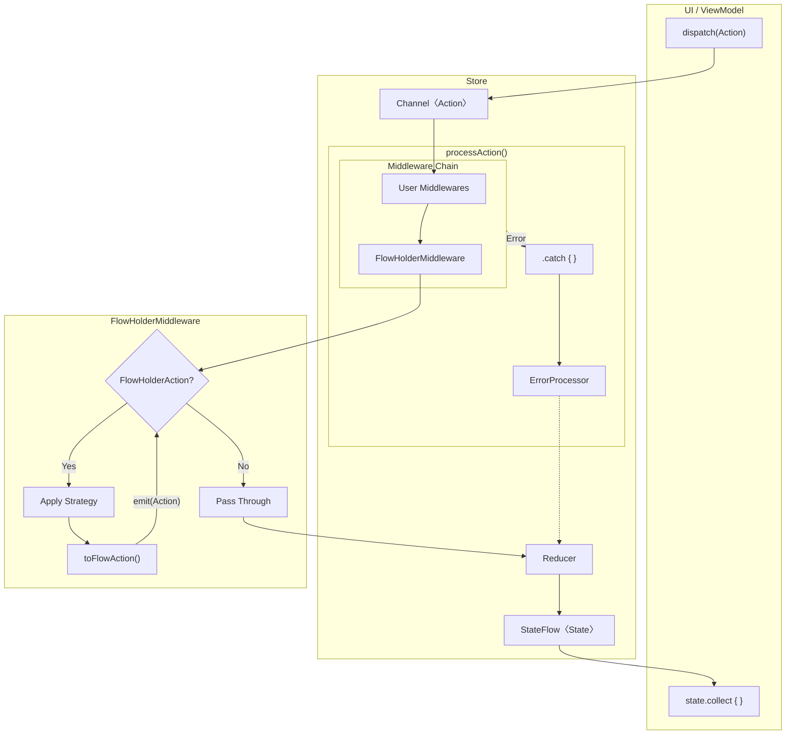

# Architecture

## Store Pipeline



## Component Overview

| Component | Role |
|-----------|------|
| **Middleware** | Side effects (API calls, logging), action transformation |
| **FlowHolderMiddleware** | Processes FlowHolderAction with ExecutionStrategy (auto-added) |
| **ExecutionStrategy** | Control concurrent action processing (takeLatest, sequential, debounce, retry, etc.) |
| **FlowHolderAction** | Convert existing Flow to Action stream |
| **ErrorProcessor** | Catch errors and convert to Actions |
| **Reducer** | Pure function: (State, Action) → NewState |

## Action Flow

Actions can enter the pipeline in two ways:

### 1. dispatch() - External Entry Point

Called from UI or ViewModel to send actions into the Store:

```
dispatch(action) → Channel → Middleware Chain → Reducer → StateFlow
```

```kotlin
// From ViewModel or UI
store.dispatch(SearchAction("query"))
```

### 2. emit() - Middleware Internal Emission

Called within middleware processors to emit resulting actions:

```
emit(action) → (Remaining Middlewares) → Reducer → StateFlow
```

```kotlin
on<SearchAction> { state, action ->
    val results = api.search(action.query)
    emit(SearchResults(results))  // Goes to Reducer
}
```

### Key Differences

| | dispatch() | emit() |
|---|---|---|
| Called from | UI, ViewModel (external) | Middleware processor (internal) |
| Entry point | Channel (full pipeline) | Current position in Flow |
| Middleware | All middlewares process | Only remaining middlewares |

## Middleware Patterns

```kotlin
// Transform: Convert action to different action
on<FetchUser> { state, action ->
    val user = api.getUser(action.id)
    emit(UserLoaded(user))
}

// Pass through: Let action continue to Reducer
on<LogAction> { state, action ->
    logger.log(action)
    emit(action)
}

// Block: Don't emit to prevent Reducer processing
on<InvalidAction> { state, action ->
    // No emit - action stops here
}

// Multiple emissions
on<BatchAction> { state, action ->
    emit(StartLoading)
    val result = api.fetch()
    emit(DataLoaded(result))
    emit(StopLoading)
}
```

**Note:** Actions without a registered processor in middleware automatically pass through to the Reducer:

```kotlin
// Middleware only handles FetchUser
on<FetchUser> { state, action -> ... }

// Other actions (Increment, Reset, etc.) pass through directly to Reducer
store.dispatch(Increment)  // → Middleware (no processor) → Reducer
```

## FlowHolderAction (Wrap Existing Flow as Actions)

Use `FlowHolderAction` to wrap existing Flows (Repository, Socket) and convert them to Actions.
No side effects in the Action—just holds and transforms the Flow:

```kotlin
// FlowHolderAction wraps an existing Flow and converts to Flow<Action>
data class ObserveUser(
    private val userFlow: Flow<User>
) : UserAction, FlowHolderAction {
    override fun toFlowAction(): Flow<Action> =
        userFlow.map { user -> SetUser(user) }
}

// Usage: pass the Flow from Repository/Socket
val repositoryFlow = userRepository.getUser(123)  // Flow creation (cold)
store.dispatch(ObserveUser(repositoryFlow))       // Store collects it
// State updates: cached user -> fresh user from API
```

### Delivery Mode

By default, inner actions emitted by `FlowHolderAction` go directly to the reducer, bypassing user middlewares (`Emit` mode). Override `delivery` to re-dispatch inner actions through the full middleware pipeline:

```kotlin
// Default: Emit - inner actions bypass middlewares (efficient)
data class ObserveUser(
    private val userFlow: Flow<User>
) : UserAction, FlowHolderAction {
    override fun toFlowAction(): Flow<Action> =
        userFlow.map { SetUser(it) }
}

// Dispatch - inner actions pass through full middleware pipeline
data class ObserveUserWithLogging(
    private val userFlow: Flow<User>
) : UserAction, FlowHolderAction {
    override val delivery get() = FlowActionDelivery.Dispatch
    override fun toFlowAction(): Flow<Action> =
        userFlow.map { SetUser(it) }
}
```

| Mode | Behavior | Use Case |
|------|----------|----------|
| `Emit` (default) | Inner actions go directly to reducer | Most cases, best performance |
| `Dispatch` | Inner actions pass through all middlewares | When middlewares need to observe/process inner actions |

## Logging

Use `DebugStoreLogger` for development debugging:

```kotlin
val store = createStore(
    initialState = CounterState(),
    reducer = counterReducer,
    logger = DebugStoreLogger("MyStore")
)
```

> **Warning:** `DebugStoreLogger` prints the entire State and Action objects via `println()`. Do not use in production as it may expose sensitive information (tokens, passwords, personal data). Use `NoOpStoreLogger` (default) or implement a custom `StoreLogger` with proper filtering for production.
