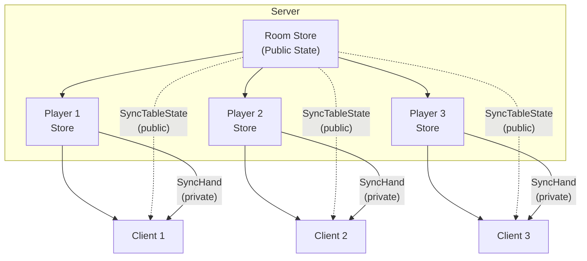

# Per-Client Pattern (1:N:N)

Per-Client 패턴은 서버가 각 클라이언트별로 독립된 비공개 상태를 관리하는 구조입니다. 클라이언트마다 다른 정보를 보여줘야 할 때 사용합니다.

## 작성해야 할 파일

**Simple (Per-Client만 사용):**
```
shared/                           # 공유 모듈
├── State.kt                      # PlayerState + 관련 data classes
└── Actions.kt                    # SharedAction (SyncHand 등)

server/                           # 서버 모듈
├── Main.kt                       # createPerClientServer() + WebSocket 라우팅
└── Reducer.kt                    # 플레이어 상태 리듀서

client/                           # 클라이언트 모듈
├── Main.kt                       # 연결, Store 생성
├── Reducer.kt                    # SyncHand 처리
└── RemoteMiddleware.kt           # SyncMiddleware 상속
```

**Hybrid (Room Store + Per-Client Store):**
```
shared/                           # 공유 모듈
├── State.kt                      # PublicTableState, PlayerState, ClientPokerState
└── Actions.kt                    # SyncTableState (공개) + SyncHand (비공개)

server/                           # 서버 모듈
├── Main.kt                       # WebSocket 라우팅
├── PokerTable.kt                 # Room Store (createSharedStateServer)
├── PlayerSession.kt              # Per-Client Store (createSingleClientServer)
└── Reducer.kt                    # 테이블 리듀서 + 플레이어 리듀서

client/                           # 클라이언트 모듈
├── Main.kt                       # 연결, Store 생성
├── Reducer.kt                    # SyncTableState + SyncHand 모두 처리
└── RemoteMiddleware.kt           # SyncMiddleware 상속
```

### Hybrid 모드 파일 역할

| 파일 | 역할 |
|------|------|
| `server/PokerTable.kt` | 공개 상태 관리 (커뮤니티 카드, 팟 등) |
| `server/PlayerSession.kt` | 비공개 상태 관리 (플레이어 손패) |
| `client/Reducer.kt` | 두 종류의 Sync 액션 모두 처리 |

## When to Use

| Use Case | What's Private |
|----------|----------------|
| **Poker / Card Games** | Each player's hand |
| **Stock Portfolio** | User's holdings and positions |
| **Exam Systems** | User's answers and progress |
| **Personalized Dashboards** | User-specific widgets and settings |
| **Multi-tenant Apps** | Tenant-specific data |

## Architecture



Each client receives:
- **Public state** from the Room Store (same for everyone)
- **Private state** from their Per-Client Store (unique to them)

## API Options

There are two ways to implement Per-Client pattern:

### 1. createPerClientServer (Simple Case)

For standalone per-client stores without a shared Room Store:

```kotlin
val playerServer = createPerClientServer(
    initialStateFactory = { playerId -> PlayerState(playerId = playerId) },
    reducer = playerReducer,
    stateMapper = { state -> SharedAction.SyncHand(state.hand) },
    scope = applicationScope,
)

webSocket("/game/{playerId}") {
    val playerId = call.parameters["playerId"]!!
    playerServer.handleClient(playerId, connection)
}
```

### 2. Room + Per-Client (Hybrid)

For games with both public and private state, combine manually:

| API | Purpose |
|-----|---------|
| `createSharedStateServer()` | Room Store for shared state |
| `createSingleClientServer()` | Per-Client Store for private state |
| `Store.serve()` | Sync private state to client |
| `store.dispatch()` | Inject updates from Room Store |

## Implementation

### 1. Define Shared Actions

```kotlin
@Serializable
sealed interface SharedPokerAction : PokerAction {
    // Client → Server
    @Serializable
    data class PlaceBet(val amount: Int) : SharedPokerAction, ServerSharedAction

    @Serializable
    data object Fold : SharedPokerAction, ServerSharedAction

    // Server → Client (public - via Room Store)
    @Serializable
    data class SyncTableState(val state: PublicTableState) : SharedPokerAction, ClientSharedAction

    // Server → Client (private - via Per-Client Store)
    @Serializable
    data class SyncHand(val cards: List<Card>) : SharedPokerAction, ClientSharedAction
}
```

### 2. Create Per-Client Store (PlayerSession)

```kotlin
class PlayerSession(
    val playerId: String,
    private val connection: TypedServerConnection<PokerAction>,
) {
    // createSingleClientServer 팩토리 사용
    val store = createSingleClientServer(
        initialState = PlayerState(playerId = playerId),
        reducer = playerReducer,
        connection = connection,
    )

    // Called by Room Store to update private hand
    fun updateHand(cards: List<Card>) {
        store.dispatch(PlayerAction.SetHand(cards))
    }

    // Serve private state to this client only
    suspend fun serve() {
        store.serve { playerState ->
            SharedPokerAction.SyncHand(playerState.hand)
        }
    }
}
```

### 3. Create Room Store (PokerTable)

```kotlin
class PokerTable(
    private val applicationScope: CoroutineScope,
) {
    private val players = ConcurrentHashMap<String, PlayerSession>()

    val roomStore = createSharedStateServer(
        initialState = ServerTableState(),
        reducer = serverTableReducer,
        processors = tableProcessors(),
        stateMapper = { state ->
            SharedPokerAction.SyncTableState(state.toPublicState())
        },
        scope = applicationScope,
    )

    init {
        // Propagate private hands to Per-Client Stores
        applicationScope.launch {
            roomStore.state.collect { tableState ->
                for ((playerId, hand) in tableState.hands) {
                    players[playerId]?.updateHand(hand)
                }
            }
        }
    }

    fun addPlayer(playerId: String, session: PlayerSession) {
        players[playerId] = session
    }
}
```

### 4. Wire Up in Server

```kotlin
webSocket("/poker/{playerId}") {
    val playerId = call.parameters["playerId"] ?: return@webSocket

    val connection = KtorWebSocketServerConnection(this)
        .typedJsonAs<SharedPokerAction, PokerAction>()

    // Create Per-Client Store
    val playerSession = PlayerSession(playerId, connection)
    pokerTable.addPlayer(playerId, playerSession)

    coroutineScope {
        // Public state (Room Store → all clients)
        launch { pokerTable.roomStore.handleClient(playerId, connection) }

        // Private state (Per-Client Store → this client only)
        launch { playerSession.serve() }
    }
}
```

> **Security Note**: The example above uses `playerId` from the URL path parameter for simplicity.
> In production, you should use server-controlled, authenticated identities instead of
> client-provided values. Otherwise, a malicious client could impersonate another player
> by connecting with their ID. See [WebSocket Authentication](./websocket-authentication.md)
> for proper authentication patterns.

## Data Flow

```
1. Game starts
   └── Room Store deals cards, stores in tableState.hands

2. Room Store state changes
   └── PokerTable.init collector observes change
       └── For each player, calls playerSession.updateHand(hand)

3. Per-Client Store receives update
   └── store.dispatch(PlayerAction.SetHand(cards))
       └── Reducer updates PlayerState.hand

4. Per-Client Store syncs to client
   └── serve() observes state change
       └── Dispatches SyncHand(hand) → middleware sends to client

5. Only that specific client receives their hand
```

## Client Implementation

### Client Middleware

```kotlin
import io.flowdux.ActionProcessorMap
import io.flowdux.remote.SyncMiddleware
import io.flowdux.remote.TypedClientConnection

sealed interface LocalPokerAction : PokerAction {
    data object Connect : LocalPokerAction
    data object Disconnect : LocalPokerAction
}

class PokerRemoteMiddleware(
    connection: TypedClientConnection<PokerAction>,
) : SyncMiddleware<ClientPokerState, PokerAction>(
    connection = connection,
) {
    override val name: String = "PokerRemoteMiddleware"

    override val processors: ActionProcessorMap<ClientPokerState, PokerAction> = buildProcessors {
        on<LocalPokerAction.Connect> { _, _ ->
            startConnection()
        }
        on<LocalPokerAction.Disconnect> { _, _ ->
            stopConnection()
        }
    }
}
```

### Client State & Reducer

The client receives both public and private state through the same connection:

```kotlin
data class ClientPokerState(
    // Public (from Room Store)
    val communityCards: List<Card> = emptyList(),
    val pot: Int = 0,
    val phase: GamePhase = GamePhase.WAITING,

    // Private (from Per-Client Store)
    val myHand: List<Card> = emptyList(),
) : State

val clientReducer = buildReducer<ClientPokerState, PokerAction> {
    on<SharedPokerAction.SyncTableState> { state, action ->
        state.copy(
            communityCards = action.state.communityCards,
            pot = action.state.pot,
            phase = action.state.phase,
        )
    }
    on<SharedPokerAction.SyncHand> { state, action ->
        state.copy(myHand = action.cards)
    }
}
```

### Client Usage

```kotlin
suspend fun main() {
    val playerId = "Alice"

    val connection = KtorWebSocketClientConnection.create(
        host = "localhost",
        port = 8080,
        path = "/poker/$playerId",
    ).typedJsonAs<SharedPokerAction, PokerAction>()

    val store = createStore(
        initialState = ClientPokerState(),
        reducer = clientReducer,
        middlewares = listOf(PokerRemoteMiddleware(connection)),
    )

    // 연결
    store.dispatch(LocalPokerAction.Connect)

    // 상태 관찰 (공개 + 비공개 모두 수신)
    store.state.collect { state ->
        println("Community: ${state.communityCards}")
        println("My Hand: ${state.myHand}")  // 본인 손패만 보임
        println("Pot: ${state.pot}")
    }

    // 베팅
    store.dispatch(SharedPokerAction.PlaceBet(100))
}
```

## Comparison with Other Patterns

| Pattern | State Scope | Use Case |
|---------|-------------|----------|
| **Simple** | 1 client per Store | Single-player, testing |
| **Multi-Client (Room Store)** | All clients share state | Chat rooms, collaborative tools |
| **Per-Client Store** | Per-client private state | Games with hidden info, personalized views |

## Example

See `kotlin/samples/flowdux-remote/poker/` for a complete working example:

```bash
# Start server
./gradlew :kotlin:sample-remote-poker:server:run

# Start clients (in separate terminals)
./gradlew :kotlin:sample-remote-poker:client:run --args="Alice"
./gradlew :kotlin:sample-remote-poker:client:run --args="Bob"

# Start game via admin endpoint
curl -X POST http://localhost:8080/start
```

## 다른 패턴으로 전환

Per-Client 패턴에서 다른 패턴으로 전환해야 하는 신호:

| 신호 | 전환 대상 |
|------|----------|
| "비공개 정보가 필요 없어요" | [Shared State](./pattern-shared-state.md) 또는 [Room](./pattern-room.md) |
| "공개 정보가 필요 없어요" | [Single Client](./pattern-single-client.md) |

## Related

- [Server Patterns Overview](./server-patterns.md) — 패턴 선택 가이드
- [Room Pattern](./pattern-room.md) — 다중 방 관리
- [Shared State Pattern](./pattern-shared-state.md) — 공유 상태 패턴
- [Remote Guide](./remote.md) — 기본 설정 가이드
