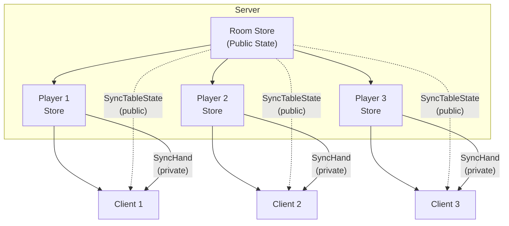

# Per-Client Store Pattern

The Per-Client Store pattern allows the server to maintain separate, private state for each connected client. This is essential when different clients should see different information.

## When to Use

| Use Case | What's Private |
|----------|----------------|
| **Poker / Card Games** | Each player's hand |
| **Stock Portfolio** | User's holdings and positions |
| **Exam Systems** | User's answers and progress |
| **Personalized Dashboards** | User-specific widgets and settings |
| **Multi-tenant Apps** | Tenant-specific data |

## Architecture



Each client receives:
- **Public state** from the Room Store (same for everyone)
- **Private state** from their Per-Client Store (unique to them)

## Existing API Combination

The Per-Client Store pattern uses existing FlowDux APIs:

| API | Purpose |
|-----|---------|
| `createRemoteServer()` | Room Store for shared state |
| `createStore()` + `SingleClientSyncMiddleware` | Per-Client Store for private state |
| `Store.serve()` | Sync private state to client |
| `store.dispatch()` | Inject updates from Room Store |

## Implementation

### 1. Define Shared Actions

```kotlin
@Serializable
sealed interface SharedPokerAction : PokerAction {
    // Client → Server
    @Serializable
    data class PlaceBet(val amount: Int) : SharedPokerAction, ServerSharedAction

    @Serializable
    data object Fold : SharedPokerAction, ServerSharedAction

    // Server → Client (public - via Room Store)
    @Serializable
    data class SyncTableState(val state: PublicTableState) : SharedPokerAction, ClientSharedAction

    // Server → Client (private - via Per-Client Store)
    @Serializable
    data class SyncHand(val cards: List<Card>) : SharedPokerAction, ClientSharedAction
}
```

### 2. Create Per-Client Store (PlayerSession)

```kotlin
class PlayerSession(
    val playerId: String,
    private val connection: TypedServerConnection<PokerAction>,
) {
    private val middleware = SingleClientSyncMiddleware<PlayerState, PokerAction>(connection)

    val store: Store<PlayerState, PokerAction> = createStore(
        initialState = PlayerState(playerId = playerId),
        reducer = playerReducer,
        middlewares = listOf(middleware),
    )

    // Called by Room Store to update private hand
    fun updateHand(cards: List<Card>) {
        store.dispatch(PlayerAction.SetHand(cards))
    }

    // Serve private state to this client only
    suspend fun serve() {
        store.serve { playerState ->
            SharedPokerAction.SyncHand(playerState.hand)
        }
    }
}
```

### 3. Create Room Store (PokerTable)

```kotlin
class PokerTable(
    private val applicationScope: CoroutineScope,
) {
    private val players = ConcurrentHashMap<String, PlayerSession>()

    val roomStore = createRemoteServer(
        initialState = ServerTableState(),
        reducer = serverTableReducer,
        processors = tableProcessors(),
        stateMapper = { state ->
            SharedPokerAction.SyncTableState(state.toPublicState())
        },
        scope = applicationScope,
    )

    init {
        // Propagate private hands to Per-Client Stores
        applicationScope.launch {
            roomStore.state.collect { tableState ->
                for ((playerId, hand) in tableState.hands) {
                    players[playerId]?.updateHand(hand)
                }
            }
        }
    }

    fun addPlayer(playerId: String, session: PlayerSession) {
        players[playerId] = session
    }
}
```

### 4. Wire Up in Server

```kotlin
webSocket("/poker/{playerId}") {
    val playerId = call.parameters["playerId"] ?: return@webSocket

    val connection = KtorWebSocketServerConnection(this)
        .typedJson<SharedPokerAction>()
        .upcast<SharedPokerAction, PokerAction>()

    // Create Per-Client Store
    val playerSession = PlayerSession(playerId, connection)
    pokerTable.addPlayer(playerId, playerSession)

    coroutineScope {
        // Public state (Room Store → all clients)
        launch { pokerTable.roomStore.handleClient(playerId, connection) }

        // Private state (Per-Client Store → this client only)
        launch { playerSession.serve() }
    }
}
```

> **Security Note**: The example above uses `playerId` from the URL path parameter for simplicity.
> In production, you should use server-controlled, authenticated identities instead of
> client-provided values. Otherwise, a malicious client could impersonate another player
> by connecting with their ID. See [WebSocket Authentication](./websocket-authentication.md)
> for proper authentication patterns.

## Data Flow

```
1. Game starts
   └── Room Store deals cards, stores in tableState.hands

2. Room Store state changes
   └── PokerTable.init collector observes change
       └── For each player, calls playerSession.updateHand(hand)

3. Per-Client Store receives update
   └── store.dispatch(PlayerAction.SetHand(cards))
       └── Reducer updates PlayerState.hand

4. Per-Client Store syncs to client
   └── serve() observes state change
       └── Dispatches SyncHand(hand) → middleware sends to client

5. Only that specific client receives their hand
```

## Client Implementation

The client receives both public and private state through the same connection:

```kotlin
data class ClientPokerState(
    // Public (from Room Store)
    val communityCards: List<Card> = emptyList(),
    val pot: Int = 0,
    val phase: GamePhase = GamePhase.WAITING,

    // Private (from Per-Client Store)
    val myHand: List<Card> = emptyList(),
) : State

val clientReducer = buildReducer<ClientPokerState, PokerAction> {
    on<SharedPokerAction.SyncTableState> { state, action ->
        state.copy(
            communityCards = action.state.communityCards,
            pot = action.state.pot,
            phase = action.state.phase,
        )
    }
    on<SharedPokerAction.SyncHand> { state, action ->
        state.copy(myHand = action.cards)
    }
}
```

## Comparison with Other Patterns

| Pattern | State Scope | Use Case |
|---------|-------------|----------|
| **Simple** | 1 client per Store | Single-player, testing |
| **Multi-Client (Room Store)** | All clients share state | Chat rooms, collaborative tools |
| **Per-Client Store** | Per-client private state | Games with hidden info, personalized views |

## Example

See `kotlin/samples/flowdux-remote/poker/` for a complete working example:

```bash
# Start server
./gradlew :kotlin:sample-remote-poker:server:run

# Start clients (in separate terminals)
./gradlew :kotlin:sample-remote-poker:client:run --args="Alice"
./gradlew :kotlin:sample-remote-poker:client:run --args="Bob"

# Start game via admin endpoint
curl -X POST http://localhost:8080/start
```

## Related

- [Remote State Sync](./remote.md) — WebSocket basics
- [Room Store Pattern](./room-store.md) — Multi-client shared state
- [Server Architecture Patterns](../design/server-architecture-patterns.md) — Architecture overview
