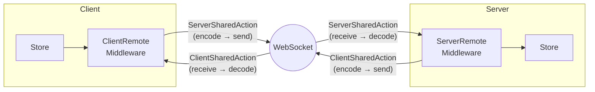

# Remote State Sync (WebSocket)

FlowDux Remote enables real-time client-server state synchronization over WebSocket.

## Architecture



| Component | Role |
|-----------|------|
| **ServerSharedAction** | Client → Server action marker (intercepted by CRM, sent over wire) |
| **ClientSharedAction** | Server → Client action marker (intercepted by SRM, sent over wire) |
| **ClientRemoteMiddleware** | Intercepts `ServerSharedAction`s, sends to server; listens for server messages |
| **ServerRemoteMiddleware** | Intercepts `ClientSharedAction`s, sends to client; listens for client messages |
| **TypedConnection** | Type-safe transport abstraction (encode/decode via `ActionCodec`) |
| **ActionCodec** | Serialization interface (`kotlinx.serialization` binding provided) |

## Installation

Add the relevant modules to your `build.gradle.kts`:

```kotlin
dependencies {
    // Shared action markers (ServerSharedAction, ClientSharedAction)
    implementation("com.github.chibimoons.flowdux:flowdux-remote-core:1.8.2")
    // Client middleware (ClientRemoteMiddleware)
    implementation("com.github.chibimoons.flowdux:flowdux-remote-client:1.8.2")
    // Server middleware (ServerRemoteMiddleware)
    implementation("com.github.chibimoons.flowdux:flowdux-remote-server:1.8.2")
    // kotlinx.serialization codecs (ActionCodec, MessageCodec)
    implementation("com.github.chibimoons.flowdux:flowdux-remote-serialization:1.8.2")
    // Ktor WebSocket transport
    implementation("com.github.chibimoons.flowdux:flowdux-remote-ktor:1.8.2")
}
```

## 1. Define Shared Actions

Actions shared between client and server use direction markers:

```kotlin
@Serializable
sealed interface SharedChatAction : ChatAction {
    // Client → Server
    @Serializable data class SendMessage(val text: String) : SharedChatAction, ServerSharedAction
    @Serializable data class JoinRoom(val user: String) : SharedChatAction, ServerSharedAction

    // Server → Client
    @Serializable data class SyncState(val state: ChatState) : SharedChatAction, ClientSharedAction
}
```

## 2. Server Setup

```kotlin
webSocket("/chat") {
    val typedConnection = KtorWebSocketServerConnection(this)
        .typedJson<SharedChatAction>() as TypedServerConnection<ChatAction>

    createStore(
        initialState = ServerChatState(),
        reducer = serverChatReducer,
        middlewares = listOf(ChatServerRemoteMiddleware(typedConnection)),
    ).serve { serverState ->
        SharedChatAction.SyncState(serverState.toChatState())
    }
}
```

`serve()` handles client message listening, state synchronization, and store cleanup automatically.

## 3. Client Setup

```kotlin
val connection = KtorWebSocketClientConnection.create(
    host = "localhost", port = 8080, path = "/chat",
).typedJson<SharedChatAction>() as TypedClientConnection<ChatAction>

val store = createStore(
    initialState = ClientChatState(),
    reducer = clientChatReducer,
    middlewares = listOf(ChatRemoteMiddleware(connection)),
)

// Connect and interact
store.dispatch(ClientChatAction.Connect)
store.dispatch(SharedChatAction.SendMessage("Hello!"))
```

See `kotlin/samples/remote-chat` for the complete working example.
