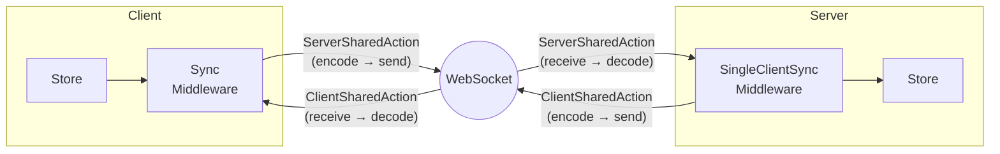

# Remote State Sync (WebSocket)

FlowDux Remote enables real-time client-server state synchronization over WebSocket.

## Architecture



| Component | Role |
|-----------|------|
| **ServerSharedAction** | Client → Server action marker (intercepted by SyncMiddleware, sent over wire) |
| **ClientSharedAction** | Server → Client action marker (intercepted by SingleClientSyncMiddleware, sent over wire) |
| **SyncMiddleware** | Intercepts `ServerSharedAction`s, sends to server; listens for server messages |
| **SingleClientSyncMiddleware** | Intercepts `ClientSharedAction`s, sends to client; listens for client messages |
| **TypedConnection** | Type-safe transport abstraction (encode/decode via `ActionCodec`) |
| **ActionCodec** | Serialization interface (`kotlinx.serialization` binding provided) |

## Installation

Add the relevant modules to your `build.gradle.kts`:

```kotlin
kotlin {
    sourceSets {
        commonMain.dependencies {
            // Shared action markers (ServerSharedAction, ClientSharedAction)
            implementation("io.github.chibimoons:flowdux-remote-core:1.13.0")
            // Client middleware (SyncMiddleware)
            implementation("io.github.chibimoons:flowdux-remote-client:1.13.0")
            // Server middleware (SingleClientSyncMiddleware, MultiClientSyncMiddleware)
            implementation("io.github.chibimoons:flowdux-remote-server:1.13.0")
            // kotlinx.serialization codecs (ActionCodec, MessageCodec)
            implementation("io.github.chibimoons:flowdux-remote-serialization:1.13.0")
            // Ktor WebSocket transport (JVM, iOS, JS — WASM not supported)
            implementation("io.github.chibimoons:flowdux-remote-ktor:1.13.0")
        }
    }
}
```

## Version Compatibility

FlowDux remote modules require matching Kotlin and serialization versions:

| Dependency | Version |
|------------|---------|
| Kotlin | 2.2.10 |
| kotlinx-serialization-json | 1.7.3 |

```kotlin
plugins {
    kotlin("multiplatform") version "2.2.10"
    kotlin("plugin.serialization") version "2.2.10"
}

kotlin {
    sourceSets {
        commonMain.dependencies {
            implementation("org.jetbrains.kotlinx:kotlinx-serialization-json:1.7.3")
        }
    }
}
```

**Important:** Using different Kotlin versions between your project and FlowDux may cause compilation errors on JS/iOS targets due to metadata incompatibility.

## 작성해야 할 파일 (Quick Reference)

FlowDux Remote를 사용하려면 다음 파일들을 작성해야 합니다:

```
shared/                           # 클라이언트/서버 공유 모듈
├── State.kt                      # @Serializable 상태 클래스
└── Actions.kt                    # @Serializable 공유 액션 (ServerSharedAction/ClientSharedAction)

server/                           # 서버 모듈
├── Main.kt                       # Ktor 서버, WebSocket 라우팅, 팩토리 함수 호출
├── Reducer.kt                    # 서버 상태 변경 로직
└── Processors.kt                 # (선택) 클라이언트 액션 → 서버 내부 액션 변환

client/                           # 클라이언트 모듈
├── Main.kt                       # 연결 생성, Store 생성, 상태 관찰
├── Reducer.kt                    # SyncState 처리
└── RemoteMiddleware.kt           # SyncMiddleware 상속 (Connect/Disconnect 처리)
```

### 패턴별 서버 팩토리 함수

| 패턴 | 팩토리 함수 | 가이드 |
|------|------------|--------|
| Single Client | `createSingleClientServer()` | [pattern-single-client.md](./pattern-single-client.md) |
| Shared State | `createSharedStateServer()` | [pattern-shared-state.md](./pattern-shared-state.md) |
| Room | `createSharedStateRoomServer()` | [pattern-room.md](./pattern-room.md) |
| Per-Client | `createPerClientServer()` | [pattern-per-client.md](./pattern-per-client.md) |

## 1. Define Shared Actions

Actions shared between client and server use direction markers.

### Recommended Pattern

Define a `@Serializable sealed interface` for your shared actions, with each variant implementing the appropriate direction marker:

```kotlin
import io.flowdux.Action
import io.flowdux.State
import io.flowdux.remote.ServerSharedAction
import io.flowdux.remote.ClientSharedAction
import kotlinx.serialization.Serializable

// Base action interface for your domain (non-sealed allows extension)
interface ChatAction : Action

// Shared actions with serialization support
@Serializable
sealed interface SharedChatAction : ChatAction {
    // Client → Server: implement ServerSharedAction
    @Serializable
    data class SendMessage(val user: String, val text: String) : SharedChatAction, ServerSharedAction

    @Serializable
    data class JoinRoom(val user: String) : SharedChatAction, ServerSharedAction

    @Serializable
    data class LeaveRoom(val user: String) : SharedChatAction, ServerSharedAction

    // Server → Client: implement ClientSharedAction
    @Serializable
    data class SyncState(val state: ChatState) : SharedChatAction, ClientSharedAction
}

// State with nested event type (events delivered via SyncState, not as separate actions)
@Serializable
data class ChatState(
    val messages: List<ChatMessage> = emptyList(),
    val users: Set<String> = emptySet(),
    val lastEvent: ChatEvent? = null,
) : State

@Serializable
data class ChatMessage(val user: String, val text: String)

@Serializable
sealed interface ChatEvent {
    @Serializable data class UserJoined(val user: String) : ChatEvent
    @Serializable data class UserLeft(val user: String) : ChatEvent
    @Serializable data class MessageReceived(val user: String, val text: String) : ChatEvent
}

// Local-only actions (not sent over network)
sealed interface LocalChatAction : ChatAction {
    data object Connect : LocalChatAction
    data object Disconnect : LocalChatAction
    data class SetCurrentUser(val user: String) : LocalChatAction
    data class SetError(val message: String) : LocalChatAction
}

// Server-only actions (internal processing, not serialized)
sealed interface ServerChatAction : ChatAction {
    data class MessageReceived(val user: String, val text: String) : ServerChatAction
    data class UserJoined(val user: String) : ServerChatAction
    data class UserLeft(val user: String) : ServerChatAction
}
```

### Key Points

1. **`@Serializable` on sealed interface** — Required for polymorphic serialization
2. **`@Serializable` on each variant** — Each data class needs its own annotation
3. **Direction markers** — `ServerSharedAction` for client→server, `ClientSharedAction` for server→client
4. **State sync pattern** — Events like `MessageReceived` are delivered inside `ChatState` via `SyncState`, not as separate shared actions
5. **Local actions** — Actions not shared don't need serialization or markers

## 2. Server Setup

Use the pattern-based API for easy setup. For manual store creation, use `createServerStore` from `io.flowdux.remote.server` for automatic `ClientSharedAction` re-dispatch.

```kotlin
import io.flowdux.remote.server.pattern.createSingleClientServer
import io.flowdux.remote.server.serve
import io.flowdux.remote.ktor.KtorWebSocketServerConnection
import io.flowdux.remote.serialization.typedJson
import io.flowdux.remote.serialization.upcast

fun main() {
    embeddedServer(CIO, port = 8080) {
        install(WebSockets)

        routing {
            webSocket("/chat") {
                println("Client connected")

                val connection = KtorWebSocketServerConnection(this)
                    .typedJson<SharedChatAction>()
                    .upcast<SharedChatAction, ChatAction>()

                // createSingleClientServer handles middleware setup internally
                val server = createSingleClientServer(
                    initialState = ServerChatState(),
                    reducer = serverChatReducer,
                    connection = connection,
                    processors = chatProcessors(),
                )

                try {
                    // serve() handles message listening and state sync
                    server.serve { serverState ->
                        SharedChatAction.SyncState(serverState.toChatState())
                    }
                } finally {
                    println("Client disconnected")
                }
            }
        }
    }.start(wait = true)
}

// Server-only state (may contain extra fields not sent to client)
data class ServerChatState(
    val messages: List<ChatMessage> = emptyList(),
    val users: Set<String> = emptySet(),
    val lastEvent: ChatEvent? = null,
) : State

fun ServerChatState.toChatState() = ChatState(
    messages = messages,
    users = users,
    lastEvent = lastEvent,
)

// Processors transform incoming actions
private fun chatProcessors() =
    Middleware.ActionProcessorBuilder<ServerChatState, ChatAction>().apply {
        on<SharedChatAction.SendMessage> { _, action ->
            emit(ServerChatAction.MessageReceived(action.user, action.text))
        }
        on<SharedChatAction.JoinRoom> { _, action ->
            emit(ServerChatAction.UserJoined(action.user))
        }
        on<SharedChatAction.LeaveRoom> { _, action ->
            emit(ServerChatAction.UserLeft(action.user))
        }
    }.build()

val serverChatReducer = buildReducer<ServerChatState, ChatAction> {
    on<ServerChatAction.MessageReceived> { state, action ->
        state.copy(
            messages = state.messages + ChatMessage(action.user, action.text),
            lastEvent = ChatEvent.MessageReceived(action.user, action.text),
        )
    }
    on<ServerChatAction.UserJoined> { state, action ->
        state.copy(
            users = state.users + action.user,
            lastEvent = ChatEvent.UserJoined(action.user),
        )
    }
    on<ServerChatAction.UserLeft> { state, action ->
        state.copy(
            users = state.users - action.user,
            lastEvent = ChatEvent.UserLeft(action.user),
        )
    }
}
```

## 3. Client Setup

### Client Store Creation

Use `createClientStore` for automatic `ServerSharedAction` re-dispatch:

```kotlin
import io.flowdux.remote.createClientStore

val store = createClientStore(
    initialState = ClientChatState(),
    syncMiddleware = ChatRemoteMiddleware(connection),
    reducer = clientChatReducer,
)
```

**Benefit:** When you `emit(ServerSharedAction)` from a middleware processor, it will be automatically re-dispatched through the full pipeline and sent to the server. Without `createClientStore`, you would need to use `sendToServer()` helper method explicitly.

### Client Middleware

The client needs a middleware to manage WebSocket connection and message routing:

```kotlin
import io.flowdux.ActionProcessorMap
import io.flowdux.remote.SyncMiddleware
import io.flowdux.remote.TypedClientConnection

class ChatRemoteMiddleware(
    connection: TypedClientConnection<ChatAction>,
) : SyncMiddleware<ClientChatState, ChatAction>(
    connection = connection,
) {
    override val name: String = "ChatRemoteMiddleware"

    override val processors: ActionProcessorMap<ClientChatState, ChatAction> = buildProcessors {
        on<LocalChatAction.Connect> { _, _ ->
            startConnection()  // Built-in: connects and listens for messages
        }
        on<LocalChatAction.Disconnect> { _, _ ->
            stopConnection()   // Built-in: disconnects cleanly
        }
    }
}
```

### Client State & Reducer

```kotlin
data class ClientChatState(
    val messages: List<ChatMessage> = emptyList(),
    val users: Set<String> = emptySet(),
    val lastEvent: ChatEvent? = null,
    val currentUser: String = "",
) : State

val clientChatReducer = buildReducer<ClientChatState, ChatAction> {
    on<SharedChatAction.SyncState> { state, action ->
        state.copy(
            messages = action.state.messages,
            users = action.state.users,
            lastEvent = action.state.lastEvent,
        )
    }
    on<LocalChatAction.SetCurrentUser> { state, action ->
        state.copy(currentUser = action.user)
    }
}
```

### Client Usage

```kotlin
import io.flowdux.remote.createClientStore
import io.flowdux.remote.ktor.KtorWebSocketClientConnection
import io.flowdux.remote.serialization.typedJson
import io.flowdux.remote.serialization.upcast

fun main() = runBlocking {
    val connection = KtorWebSocketClientConnection.create(
        host = "localhost",
        port = 8080,
        path = "/chat",
    ).typedJson<SharedChatAction>()
     .upcast<SharedChatAction, ChatAction>()

    // Use createClientStore for automatic ServerSharedAction re-dispatch
    val store = createClientStore(
        initialState = ClientChatState(),
        syncMiddleware = ChatRemoteMiddleware(connection),
        reducer = clientChatReducer,
    )

    // Observe state changes
    val job = launch {
        store.state.collect { state ->
            when (val event = state.lastEvent) {
                is ChatEvent.UserJoined -> println("[System] ${event.user} joined")
                is ChatEvent.MessageReceived -> println("[${event.user}] ${event.text}")
                else -> {}
            }
        }
    }

    // Connect and interact
    store.dispatch(LocalChatAction.Connect)
    delay(500)

    store.dispatch(SharedChatAction.JoinRoom("Alice"))
    store.dispatch(SharedChatAction.SendMessage("Alice", "Hello everyone!"))

    // Cleanup
    store.dispatch(LocalChatAction.Disconnect)
    job.cancel()
    store.close()
}
```

See `kotlin/samples/flowdux-remote/simple` for a complete working example.

## Next Steps

- [Server Patterns Overview](./server-patterns.md) — Pattern selection guide (Single Client, Shared State, Room, Per-Client)
- [Scaling Architecture](./scaling.md) — Parallel broadcast for large-scale deployments
- [Room Pattern](./pattern-room.md) — Multi-room management, session-aware broadcasting
- [Per-Client Pattern](./pattern-per-client.md) — Private state per client (poker hands, portfolios)
- [FlowDux Remote vs Raw WebSocket](./flowdux-remote-vs-raw.md) — Use case comparison and when to use each approach
