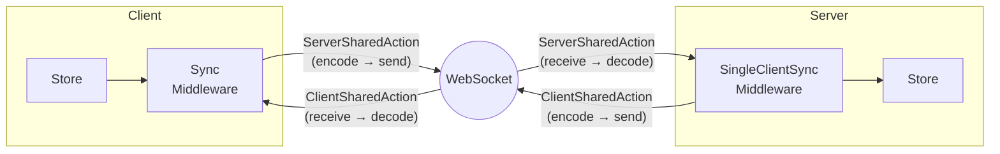

# Remote State Sync (WebSocket)

FlowDux Remote enables real-time client-server state synchronization over WebSocket.

## Architecture



| Component | Role |
|-----------|------|
| **ServerSharedAction** | Client → Server action marker (intercepted by SyncMiddleware, sent over wire) |
| **ClientSharedAction** | Server → Client action marker (intercepted by SingleClientSyncMiddleware, sent over wire) |
| **SyncMiddleware** | Intercepts `ServerSharedAction`s, sends to server; listens for server messages |
| **SingleClientSyncMiddleware** | Intercepts `ClientSharedAction`s, sends to client; listens for client messages |
| **TypedConnection** | Type-safe transport abstraction (encode/decode via `ActionCodec`) |
| **ActionCodec** | Serialization interface (`kotlinx.serialization` binding provided) |

## Installation

Add the relevant modules to your `build.gradle.kts`:

```kotlin
kotlin {
    sourceSets {
        commonMain.dependencies {
            // Shared action markers (ServerSharedAction, ClientSharedAction)
            implementation("io.github.chibimoons:flowdux-remote-core:1.12.0")
            // Client middleware (SyncMiddleware)
            implementation("io.github.chibimoons:flowdux-remote-client:1.12.0")
            // Server middleware (SingleClientSyncMiddleware, MultiClientSyncMiddleware)
            implementation("io.github.chibimoons:flowdux-remote-server:1.12.0")
            // kotlinx.serialization codecs (ActionCodec, MessageCodec)
            implementation("io.github.chibimoons:flowdux-remote-serialization:1.12.0")
            // Ktor WebSocket transport (JVM, iOS, JS — WASM not supported)
            implementation("io.github.chibimoons:flowdux-remote-ktor:1.12.0")
        }
    }
}
```

## Version Compatibility

FlowDux remote modules require matching Kotlin and serialization versions:

| Dependency | Version |
|------------|---------|
| Kotlin | 2.2.10 |
| kotlinx-serialization-json | 1.7.3 |

```kotlin
plugins {
    kotlin("multiplatform") version "2.2.10"
    kotlin("plugin.serialization") version "2.2.10"
}

kotlin {
    sourceSets {
        commonMain.dependencies {
            implementation("org.jetbrains.kotlinx:kotlinx-serialization-json:1.7.3")
        }
    }
}
```

**Important:** Using different Kotlin versions between your project and FlowDux may cause compilation errors on JS/iOS targets due to metadata incompatibility.

## 1. Define Shared Actions

Actions shared between client and server use direction markers.

### Recommended Pattern

Define a `@Serializable sealed interface` for your shared actions, with each variant implementing the appropriate direction marker:

```kotlin
import io.flowdux.Action
import io.flowdux.State
import io.flowdux.remote.ServerSharedAction
import io.flowdux.remote.ClientSharedAction
import kotlinx.serialization.Serializable

// Base action interface for your domain (non-sealed allows extension)
interface ChatAction : Action

// Shared actions with serialization support
@Serializable
sealed interface SharedChatAction : ChatAction {
    // Client → Server: implement ServerSharedAction
    @Serializable
    data class SendMessage(val user: String, val text: String) : SharedChatAction, ServerSharedAction

    @Serializable
    data class JoinRoom(val user: String) : SharedChatAction, ServerSharedAction

    @Serializable
    data class LeaveRoom(val user: String) : SharedChatAction, ServerSharedAction

    // Server → Client: implement ClientSharedAction
    @Serializable
    data class SyncState(val state: ChatState) : SharedChatAction, ClientSharedAction
}

// State with nested event type (events delivered via SyncState, not as separate actions)
@Serializable
data class ChatState(
    val messages: List<ChatMessage> = emptyList(),
    val users: Set<String> = emptySet(),
    val lastEvent: ChatEvent? = null,
) : State

@Serializable
data class ChatMessage(val user: String, val text: String)

@Serializable
sealed interface ChatEvent {
    @Serializable data class UserJoined(val user: String) : ChatEvent
    @Serializable data class UserLeft(val user: String) : ChatEvent
    @Serializable data class MessageReceived(val user: String, val text: String) : ChatEvent
}

// Local-only actions (not sent over network)
sealed interface LocalChatAction : ChatAction {
    data object Connect : LocalChatAction
    data object Disconnect : LocalChatAction
    data class SetError(val message: String) : LocalChatAction
}
```

### Key Points

1. **`@Serializable` on sealed interface** — Required for polymorphic serialization
2. **`@Serializable` on each variant** — Each data class needs its own annotation
3. **Direction markers** — `ServerSharedAction` for client→server, `ClientSharedAction` for server→client
4. **State sync pattern** — Events like `MessageReceived` are delivered inside `ChatState` via `SyncState`, not as separate shared actions
5. **Local actions** — Actions not shared don't need serialization or markers

## 2. Server Setup

```kotlin
webSocket("/chat") {
    val typedConnection = KtorWebSocketServerConnection(this)
        .typedJson<SharedChatAction>() as TypedServerConnection<ChatAction>

    createStore(
        initialState = ServerChatState(),
        reducer = serverChatReducer,
        middlewares = listOf(ChatServerRemoteMiddleware(typedConnection)),
    ).serve { serverState ->
        SharedChatAction.SyncState(serverState.toChatState())
    }
}
```

`serve()` handles client message listening, state synchronization, and store cleanup automatically.

## 3. Client Setup

```kotlin
val connection = KtorWebSocketClientConnection.create(
    host = "localhost", port = 8080, path = "/chat",
).typedJson<SharedChatAction>() as TypedClientConnection<ChatAction>

val store = createStore(
    initialState = ClientChatState(),
    reducer = clientChatReducer,
    middlewares = listOf(ChatRemoteMiddleware(connection)),
)

// Connect and interact
store.dispatch(ClientChatAction.Connect)
store.dispatch(SharedChatAction.SendMessage("Hello!"))
```

See `kotlin/samples/flowdux-remote` for complete working examples.

## Next Steps

- [Scaling Architecture](./scaling.md) — Parallel broadcast for large-scale deployments
- [Room Store Pattern](./room-store.md) — Multi-room management, session-aware broadcasting
- [Per-Client Store Pattern](./per-client-store.md) — Private state per client (poker hands, portfolios)
- [Server Architecture Patterns](../design/server-architecture-patterns.md) — Central Store, Room Store, Per-Client Store patterns
- [FlowDux Remote vs Raw WebSocket](./flowdux-remote-vs-raw.md) — Use case comparison and when to use each approach
