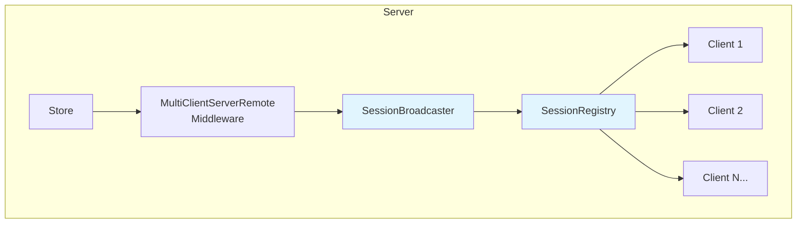

# Scaling Architecture

FlowDux Remote is designed for large-scale deployments through parallel broadcast and pluggable session storage.

## Overview



| Component | Role |
|-----------|------|
| **SessionRegistry** | Interface for storing and managing client sessions |
| **InMemorySessionRegistry** | Default thread-safe in-memory implementation (single node) |
| **SessionBroadcaster** | Handles parallel message delivery to multiple clients |
| **BroadcastConfig** | Configuration for broadcast concurrency |

## Quick Start

### Default (Sequential Broadcast)

The default configuration uses sequential broadcast:

```kotlin
val server = createSharedStateServer(
    initialState = ChatState(),
    reducer = chatReducer,
    stateMapper = { SyncState(it) },
)
```

### Parallel Broadcast

For high-throughput scenarios with many concurrent clients:

```kotlin
val server = createSharedStateServer(
    initialState = ChatState(),
    reducer = chatReducer,
    stateMapper = { SyncState(it) },
    broadcastConfig = BroadcastConfig(concurrency = 32),
)
```

## BroadcastConfig

Controls how messages are delivered to multiple clients.

```kotlin
data class BroadcastConfig(
    val concurrency: Int = 1,  // Number of parallel sends
)
```

### Preset Configurations

| Preset | Concurrency | Use Case |
|--------|-------------|----------|
| `BroadcastConfig.Sequential` | 1 | Default, lowest memory |
| `BroadcastConfig.Default` | 16 | Moderate scale (10k clients) |
| `BroadcastConfig.HighThroughput` | 64 | Large scale (100k+ clients) |

### Choosing Concurrency

| Clients | Recommended Concurrency |
|---------|------------------------|
| < 1,000 | 1 (sequential) |
| 1,000 - 10,000 | 8-16 |
| 10,000 - 100,000 | 32-64 |
| 100,000+ | 64-128 + custom SessionRegistry |

```kotlin
// Moderate scale
val config = BroadcastConfig(concurrency = 16)

// High throughput
val config = BroadcastConfig.HighThroughput  // concurrency = 64
```

## SessionRegistry

Interface for managing client session storage.

```kotlin
interface SessionRegistry<A : Action> {
    suspend fun sessionIds(): Set<String>
    suspend fun sessionCount(): Int
    suspend fun addSession(sessionId: String, connection: TypedServerConnection<A>)
    suspend fun removeSession(sessionId: String)
    suspend fun getSession(sessionId: String): TypedServerConnection<A>?
    suspend fun getSessions(): Map<String, TypedServerConnection<A>>
}
```

### InMemorySessionRegistry (Default)

Thread-safe in-memory implementation using Mutex:

```kotlin
val registry = InMemorySessionRegistry<ChatAction>()

val server = createSharedStateServer(
    initialState = ChatState(),
    reducer = chatReducer,
    stateMapper = { SyncState(it) },
    sessionRegistry = registry,
    broadcastConfig = BroadcastConfig(concurrency = 32),
)

// Access registry directly if needed
val clientCount = registry.sessionCount()
val allSessions = registry.getSessions()
```

### Custom SessionRegistry (Redis Example)

For distributed deployments across multiple nodes:

```kotlin
class RedisSessionRegistry<A : Action>(
    private val redis: RedisClient,
    private val codec: ActionCodec<A>,
) : SessionRegistry<A> {

    override suspend fun sessionIds(): Set<String> {
        return redis.smembers("sessions").toSet()
    }

    override suspend fun sessionCount(): Int {
        return redis.scard("sessions").toInt()
    }

    override suspend fun addSession(sessionId: String, connection: TypedServerConnection<A>) {
        redis.sadd("sessions", sessionId)
        // Store connection reference for this node only
        localConnections[sessionId] = connection
    }

    override suspend fun removeSession(sessionId: String) {
        redis.srem("sessions", sessionId)
        localConnections.remove(sessionId)
    }

    override suspend fun getSession(sessionId: String): TypedServerConnection<A>? {
        return localConnections[sessionId]
    }

    override suspend fun getSessions(): Map<String, TypedServerConnection<A>> {
        return localConnections.toMap()
    }

    private val localConnections = ConcurrentHashMap<String, TypedServerConnection<A>>()
}
```

> **Note:** This example shows session ID storage in Redis. For cross-node broadcast, you'll also need Redis Pub/Sub or a message queue (e.g., Kafka) to fan out messages to all nodes.

Usage:

```kotlin
val redisRegistry = RedisSessionRegistry<ChatAction>(redisClient, codec)

val server = createSharedStateServer(
    initialState = ChatState(),
    reducer = chatReducer,
    stateMapper = { SyncState(it) },
    sessionRegistry = redisRegistry,
    broadcastConfig = BroadcastConfig(concurrency = 64),
)
```

## SessionBroadcaster

Handles efficient message delivery to multiple clients.

```kotlin
class SessionBroadcaster<A : Action>(
    private val registry: SessionRegistry<A>,
    private val config: BroadcastConfig = BroadcastConfig.Sequential,
) {
    // Send to specific client
    suspend fun sendToClient(sessionId: String, action: A)

    // Broadcast to all clients
    suspend fun broadcast(action: A)

    // Per-session custom action
    suspend fun sendPerSession(mapper: (sessionId: String) -> A?)
}
```

### How Parallel Broadcast Works

When `concurrency > 1`, broadcasts use `flatMapMerge` for parallel delivery:

```
Sequential (concurrency = 1):
  Client1 → Client2 → Client3 → Client4 → ...

Parallel (concurrency = 4):
  [Client1, Client2, Client3, Client4] → [Client5, Client6, Client7, Client8] → ...
```

Individual connection failures are isolated and don't affect other sends.

## SharedStateServer API

Convenient methods for broadcasting:

```kotlin
val server = createSharedStateServer(...)

// Broadcast to all clients
server.broadcast(SyncState(state))

// Send to specific client
server.sendToClient(sessionId, PrivateMessage(text))

// Read-only session info
val count = server.sessionCount()
val ids = server.sessionIds()
```

> **Note:** Session management is handled internally via internal actions. For direct registry access, keep a reference to the `SessionRegistry` you pass to `createSharedStateServer()`.

## Complete Example

```kotlin
fun main() {
    val scope = CoroutineScope(SupervisorJob() + Dispatchers.Default)

    // Configure for high throughput
    val broadcastConfig = BroadcastConfig(concurrency = 32)
    val sessionRegistry = InMemorySessionRegistry<ChatAction>()

    val server = createSharedStateServer(
        initialState = ChatState(),
        reducer = chatReducer,
        stateMapper = { SharedChatAction.SyncState(it) },
        sessionRegistry = sessionRegistry,
        broadcastConfig = broadcastConfig,
        scope = scope,
    )

    // Monitor stats
    scope.launch {
        while (isActive) {
            delay(5.seconds)
            val count = server.sessionCount()
            println("Connected clients: $count")
        }
    }

    embeddedServer(CIO, port = 8080) {
        install(WebSockets)

        routing {
            webSocket("/chat") {
                val sessionId = UUID.randomUUID().toString()
                val connection = KtorWebSocketServerConnection(this)
                    .typedJson<SharedChatAction>()
                    .upcast<SharedChatAction, ChatAction>()

                server.handleClient(sessionId, connection)
            }
        }
    }.start(wait = true)
}
```

## Scaling Roadmap

| Stage | Scale | Implementation |
|-------|-------|----------------|
| Current | ~10k | Sequential broadcast |
| Stage 1 | ~100k | Parallel broadcast (`BroadcastConfig`) |
| Stage 2 | ~1M | Custom `SessionRegistry` (Redis) |
| Stage 3 | ~10M+ | Kafka + Redis Cluster |

## Sample Application

See the scaling demo for a complete working example:

```bash
./gradlew :kotlin:sample-remote-scaling:server:run
```

Test endpoints:
- `GET /stats` - Current server statistics
- `POST /broadcast` - Trigger manual broadcast
- `POST /stress/{count}` - Stress test with counter increments

## Best Practices

1. **Start simple** — Use default sequential broadcast until you measure bottlenecks
2. **Profile first** — Measure actual broadcast latency before increasing concurrency
3. **Consider memory** — Higher concurrency uses more coroutines and memory
4. **Isolate failures** — Broadcaster catches individual connection errors automatically
5. **Monitor metrics** — Track broadcast latency, error rates, and memory usage

## Next Steps

- [Server Patterns Overview](./server-patterns.md) — Pattern selection guide
- [Remote State Sync](./remote.md) — Basic client-server setup
- [Room Pattern](./pattern-room.md) — Multi-room management
