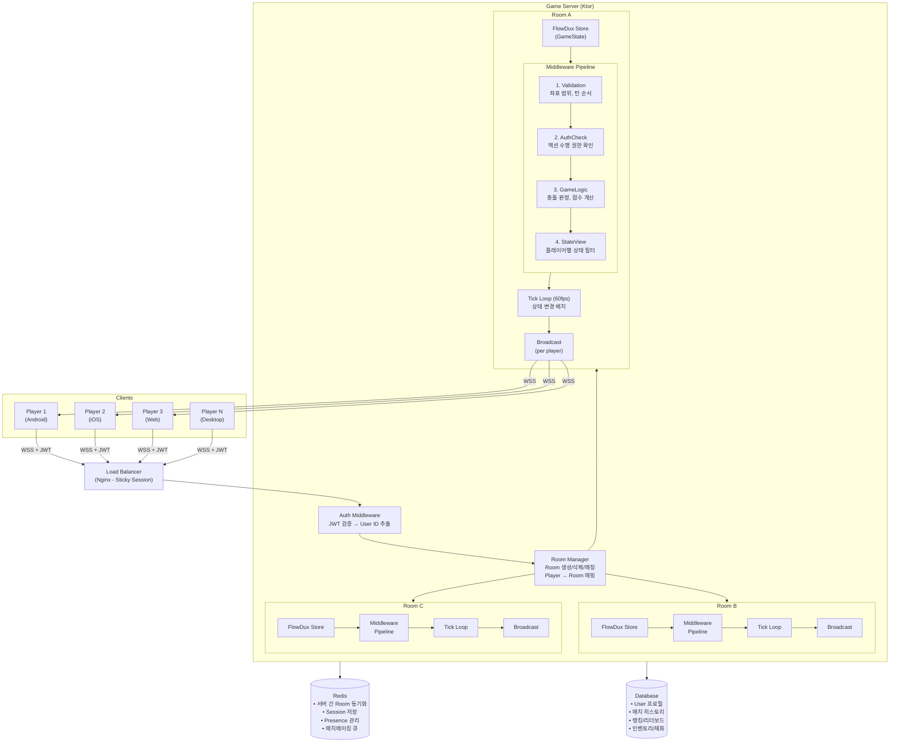
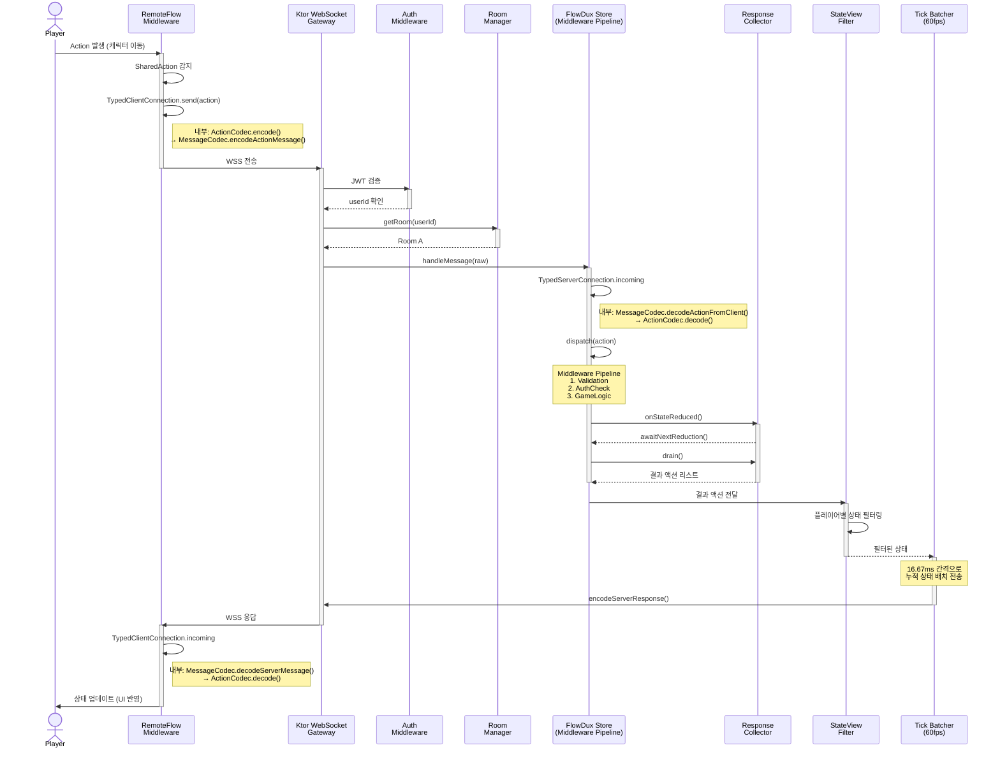
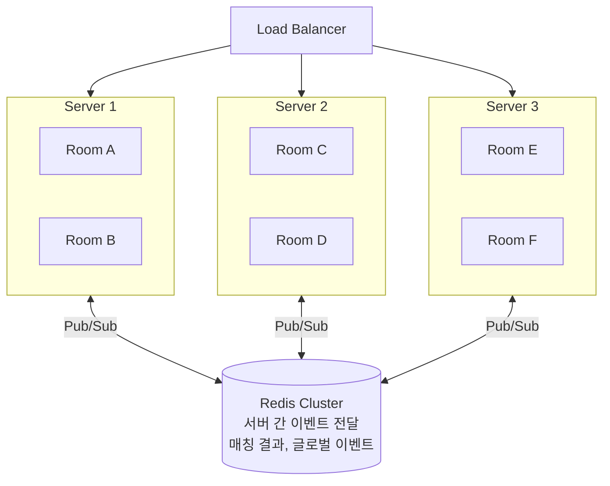
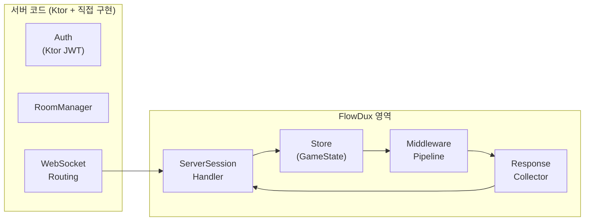

# FlowDux Multiplayer Game Server Architecture

> **Design Document** — 이 문서는 FlowDux 기반 멀티플레이어 게임 서버의 **목표 아키텍처**를 설명합니다.
> 현재 구현 상태는 [§7. 현재 구현 상태](#7-현재-구현-상태)를 참고하세요.

## 1. 전체 아키텍처



## 2. 요청 흐름



## 3. 스케일 아웃



## 4. FlowDux 영역 vs 서버 코드 영역

아키텍처의 각 구성요소가 FlowDux인지, 서버 자체 코드인지 구분이 중요합니다.

| 구성요소 | 정체 | FlowDux? |
|---------|------|----------|
| **Auth Middleware** | Ktor Authentication 플러그인 (JWT 검증) | X |
| **RoomManager** | 서버 자체 로직 (Room 생성/매칭/삭제) | X |
| **Room 안의 Store** | `createStore()` - 게임 상태 관리 | **O** |
| **Room 안의 Middleware Pipeline** | FlowDux `Middleware` (검증, 게임 로직) | **O** |
| **ServerSessionHandler** | FlowDux remote 모듈 (메시지 ↔ Store 연결) | **O** |
| **ResponseCollector** | FlowDux remote 모듈 (결과 액션 수집) | **O** |
| **Tick Loop / StateView** | 서버 코드 (향후 FlowDux 기능으로 추가 가능) | X |



## 5. 샘플 코드: 서버와 FlowDux 통합

### 5-1. 게임 상태와 액션 정의 (FlowDux)

```kotlin
// shared 모듈 - 클라이언트/서버 공유

data class GameState(
    val players: Map<String, Player> = emptyMap(),
    val projectiles: List<Projectile> = emptyList(),
    val tick: Long = 0,
) : State

data class Player(val id: String, val x: Float, val y: Float, val hp: Int = 100)
data class Projectile(val ownerId: String, val x: Float, val y: Float, val dx: Float, val dy: Float)

sealed interface GameAction : Action {
    // Client → Server (SharedAction)
    data class Move(val playerId: String, val x: Float, val y: Float) : GameAction, SharedAction
    data class Shoot(val playerId: String, val dx: Float, val dy: Float) : GameAction, SharedAction
    data class JoinGame(val playerId: String) : GameAction, SharedAction

    // Server → Client (결과 액션, 로컬 리듀서용)
    data class PlayerMoved(val playerId: String, val x: Float, val y: Float) : GameAction
    data class ProjectileFired(val projectile: Projectile) : GameAction
    data class PlayerJoined(val player: Player) : GameAction
    data class PlayerHit(val playerId: String, val damage: Int) : GameAction
    data class TickUpdate(val tick: Long) : GameAction
}

val gameReducer: Reducer<GameState, GameAction> = buildReducer {
    on<GameAction.PlayerMoved> { state, action ->
        val player = state.players[action.playerId] ?: return@on state
        state.copy(players = state.players + (action.playerId to player.copy(x = action.x, y = action.y)))
    }
    on<GameAction.PlayerJoined> { state, action ->
        state.copy(players = state.players + (action.player.id to action.player))
    }
    on<GameAction.ProjectileFired> { state, action ->
        state.copy(projectiles = state.projectiles + action.projectile)
    }
    on<GameAction.PlayerHit> { state, action ->
        val player = state.players[action.playerId] ?: return@on state
        state.copy(players = state.players + (action.playerId to player.copy(hp = player.hp - action.damage)))
    }
}
```

### 5-2. 게임 로직 미들웨어 (FlowDux)

```kotlin
// server 모듈

/** SharedAction을 검증하고 결과 액션으로 변환하는 미들웨어 */
class GameLogicMiddleware : Middleware<GameState, GameAction> {
    override val name = "GameLogic"

    override val processors: ActionProcessorMap<GameState, GameAction> = buildProcessors {
        on<GameAction.Move> { state, action ->
            // 검증: 이동 범위 체크
            val clampedX = action.x.coerceIn(0f, 1000f)
            val clampedY = action.y.coerceIn(0f, 1000f)
            emit(GameAction.PlayerMoved(action.playerId, clampedX, clampedY))
        }
        on<GameAction.Shoot> { state, action ->
            val player = state.players[action.playerId] ?: return@on
            val projectile = Projectile(
                ownerId = action.playerId,
                x = player.x, y = player.y,
                dx = action.dx, dy = action.dy,
            )
            emit(GameAction.ProjectileFired(projectile))
        }
        on<GameAction.JoinGame> { _, action ->
            val player = Player(id = action.playerId, x = 500f, y = 500f)
            emit(GameAction.PlayerJoined(player))
        }
    }
}
```

### 5-3. Room과 RoomManager (서버 코드, FlowDux 아님)

```kotlin
// server 모듈

/** Room = FlowDux Store 1개를 감싸는 서버 컨테이너 */
class Room(
    val id: String,
    val maxPlayers: Int = 4,
) {
    // FlowDux 영역 ────────────────────────────────
    private val handler = ServerSessionHandler<GameState, GameAction>(
        storeFactory = { connection ->
            val typedConn = connection.typed(actionCodecOf<GameAction>(), JsonMessageCodec())
            val srm = GameServerRemoteMiddleware(typedConn)
            createStore(
                initialState = GameState(),
                reducer = gameReducer,
                middlewares = listOf(GameLogicMiddleware(), srm),
                scope = CoroutineScope(SupervisorJob() + Dispatchers.Default),
            )
        },
        connection = serverConnection,
    )
    // ──────────────────────────────────────────────

    // 서버 코드 영역 ──────────────────────────────
    private val players = ConcurrentHashMap<String, WebSocketSession>()

    fun initialize() = handler.initialize()

    val playerCount: Int get() = players.size
    val isFull: Boolean get() = players.size >= maxPlayers

    fun addPlayer(playerId: String, session: WebSocketSession) {
        players[playerId] = session
    }

    fun removePlayer(playerId: String) {
        players.remove(playerId)
    }

    /** 클라이언트 메시지 처리 → 결과를 같은 Room의 모든 플레이어에게 브로드캐스트 */
    suspend fun handleMessage(raw: String) {
        val response = handler.handleMessage(raw)

        // 같은 Room의 모든 플레이어에게 전송
        players.values.forEach { session ->
            session.send(Frame.Text(response))
        }
    }

    fun close() {
        handler.close()
        players.clear()
    }
    // ──────────────────────────────────────────────
}

/** Room 생성/삭제/매칭 관리 (순수 서버 코드, FlowDux 아님) */
class RoomManager {
    private val rooms = ConcurrentHashMap<String, Room>()
    private val playerRoomMap = ConcurrentHashMap<String, String>()  // playerId → roomId

    /** 빈 Room 찾거나 새로 생성 */
    fun findOrCreateRoom(playerId: String): Room {
        // 이미 Room에 있는 경우
        playerRoomMap[playerId]?.let { roomId ->
            rooms[roomId]?.let { return it }
        }

        // 빈자리 있는 Room 찾기
        val available = rooms.values.firstOrNull { !it.isFull }
        if (available != null) {
            playerRoomMap[playerId] = available.id
            return available
        }

        // 새 Room 생성
        val room = Room(id = "room-${rooms.size + 1}")
        room.initialize()
        rooms[room.id] = room
        playerRoomMap[playerId] = room.id
        return room
    }

    fun removePlayer(playerId: String) {
        val roomId = playerRoomMap.remove(playerId) ?: return
        val room = rooms[roomId] ?: return
        room.removePlayer(playerId)

        // Room이 비면 정리
        if (room.playerCount == 0) {
            room.close()
            rooms.remove(roomId)
        }
    }
}
```

### 5-4. Ktor 서버 메인 (서버 코드)

```kotlin
// server 모듈

fun main() {
    val roomManager = RoomManager()

    embeddedServer(CIO, port = 8080) {
        // ── Ktor 플러그인 (서버 코드) ──
        install(WebSockets)
        install(Authentication) {
            jwt("game-auth") {
                verifier(JwtConfig.verifier)
                validate { credential ->
                    val userId = credential.payload.getClaim("userId").asString()
                    if (userId != null) JWTPrincipal(credential.payload) else null
                }
            }
        }

        routing {
            // ── 인증 (Ktor, FlowDux 아님) ──
            authenticate("game-auth") {

                webSocket("/game") {
                    val userId = call.principal<JWTPrincipal>()!!
                        .payload.getClaim("userId").asString()

                    // ── Room 매칭 (서버 코드) ──
                    val room = roomManager.findOrCreateRoom(userId)
                    room.addPlayer(userId, this)

                    try {
                        // ── 메시지 루프 ──
                        for (frame in incoming) {
                            if (frame is Frame.Text) {
                                // 여기서 FlowDux 영역 진입:
                                //   handleMessage → ServerSessionHandler
                                //   → dispatch → Middleware → Reducer
                                //   → ResponseCollector → broadcast
                                room.handleMessage(frame.readText())
                            }
                        }
                    } finally {
                        // ── 정리 (서버 코드) ──
                        room.removePlayer(userId)
                        roomManager.removePlayer(userId)
                    }
                }
            }
        }
    }.start(wait = true)
}
```

### 5-5. 코드 영역 요약

```
서버 코드 (Ktor)                     FlowDux 영역
──────────────────                   ─────────────────────────
main()                               GameState, GameAction (상태/액션 정의)
├─ install(Authentication)           gameReducer (상태 변환 로직)
├─ install(WebSockets)               GameLogicMiddleware (게임 로직)
├─ authenticate("game-auth")         ServerSessionHandler (메시지 ↔ Store)
├─ RoomManager.findOrCreateRoom()    ResponseCollector (결과 수집)
├─ room.addPlayer()                  createStore() (Store 생성)
├─ for (frame in incoming)
│   └─ room.handleMessage() ──────→  handler.handleMessage()
│                                      ├─ decode → dispatch → middleware
│                                      ├─ reducer → collector
│                                      └─ encode response
├─ room.broadcast() ◄────────────── response
└─ room.removePlayer()
```

## 6. 핵심 설계 포인트

| 구성요소 | 역할 | FlowDux 연관 |
|---------|------|-------------|
| **Room = Store** | Room 1개 = FlowDux Store 1개 | 상태 격리, 독립적 생명주기 |
| **Middleware** | 검증 → 인증 → 로직 → 필터 | 기존 FlowDux 미들웨어 파이프라인 그대로 |
| **Tick Loop** | 16.67ms마다 상태 변경 배치 전송 | [#76](https://github.com/chibimoons/flowdux/issues/76) 해결 후 구현 가능 |
| **StateView** | 플레이어별 보이는 상태만 전송 | 신규 기능 필요 |
| **Redis** | 서버 간 통신, 매칭 | FlowDux 외부, 인프라 레벨 |

## 7. 현재 구현 상태

- Room 내부 (Store + Middleware + Broadcast): **구현 가능**
- KtorWebSocketConnection disconnect 정리: [#76](https://github.com/chibimoons/flowdux/issues/76)
- ResponseCollector race condition 수정: [#77](https://github.com/chibimoons/flowdux/issues/77)
- StateView, Tick Batching: 추가 개발 필요
